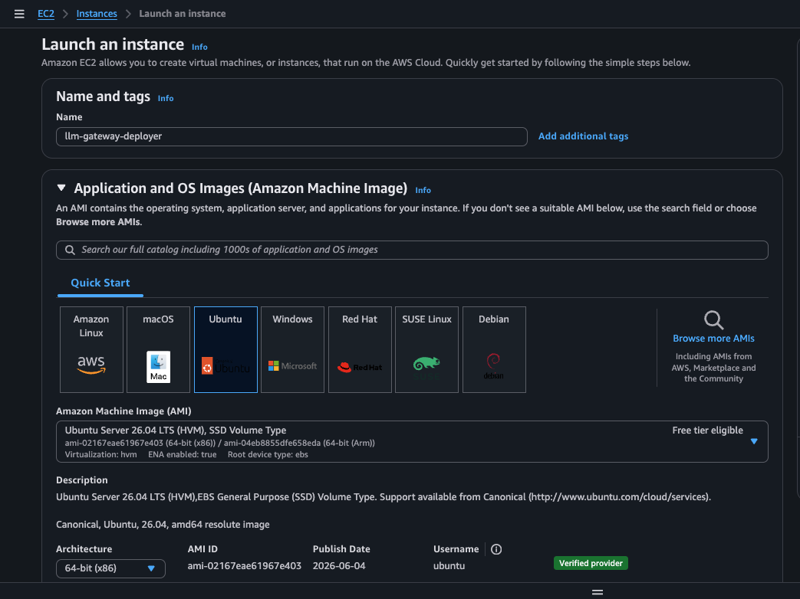
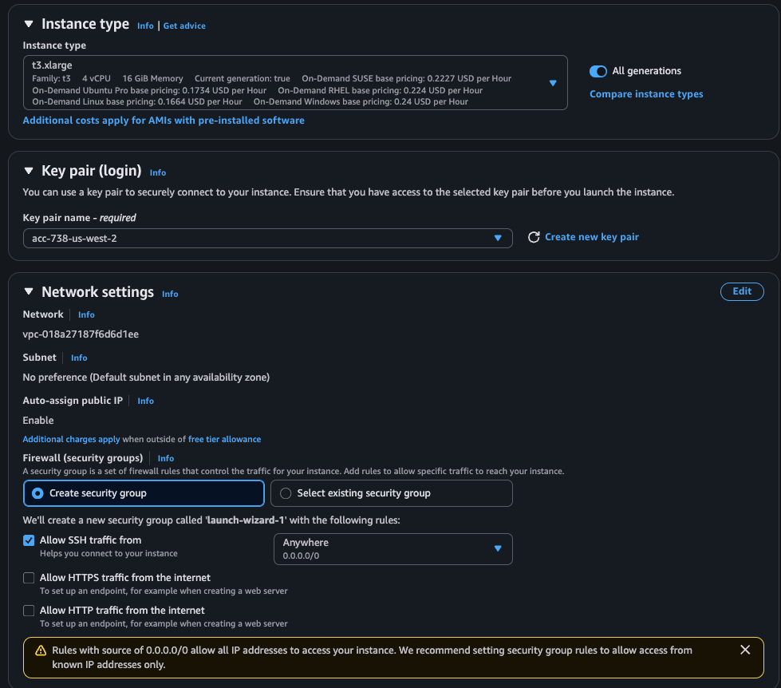
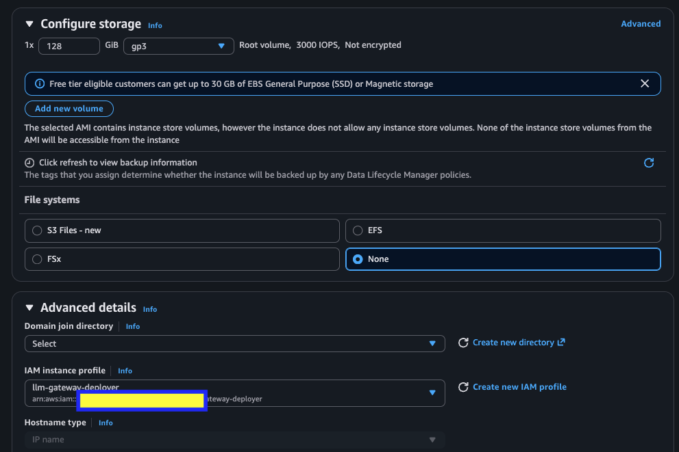

# US LLM Gateway 설치 — 실행 런북 (§1~§6)

> 개요·범위·설치 흐름은 **[README.md](README.md)** 에 있다. 이 문서는 **위에서 아래로 실행**한다.
> `§8`(재배포·prod 승격·teardown·보안 하드닝) 은 **[operations.md](operations.md)** 로 분리했다.

---

## 1. 사전 준비

### 1-1. 설치 작업 환경 (작업자 Laptop)

> **한 줄**: 랩톱에는 VS Code + Remote-SSH 확장만 깔면 된다 — AWS 명령과 도구는 **전부 배포 EC2 에서** 돌므로 랩톱은 화면·키보드 역할이고 aws-cli 도 필요 없다.

- VS Code 또는 IDE (예: Cursor) — 작업자 Laptop (Mac or Windows).
- IDE 는 아래 **Deployment EC2** 에 SSH 로 연결하여 Terminal 및 Coding Tool(Claude Code on Amazon Bedrock)을 이용한다. Coding Tool 은 설치 과정의 트러블슈팅 등에 사용한다.

**랩톱에 설치** (EC2 가 아직 없어도 지금 해두면 된다 — 실제 연결은 §1-2 에서):

1. **VS Code** — [https://code.visualstudio.com/download](https://code.visualstudio.com/download) 에서 Mac/Windows 설치본. (Cursor 를 쓰면 건너뛴다 — 아래 확장이 내장.)
2. **Remote - SSH 확장** — VS Code 좌측 Extensions(`⇧⌘X`(Mac) / `Ctrl+Shift+X`(Windows)) → `Remote - SSH` 검색 → Install (publisher **Microsoft**, id `ms-vscode-remote.remote-ssh`)
3. **SSH 클라이언트** — §1-2 에서 EC2 에 SSH 로 붙을 때 쓴다.
   - **Mac**: 기본 내장(별도 설치 없음).
   - **Windows 10/11**: 대개 내장돼 있다. PowerShell 에서 `ssh -V` 로 확인 → 없으면 **설정 ▸ 시스템 ▸ 선택적 기능 ▸ 기능 추가 ▸ "OpenSSH 클라이언트"** 설치. (Git for Windows 의 `ssh` 도 가능.)

> 랩톱에 aws-cli 는 **필요 없다** — AWS 명령은 전부 배포 EC2(§2-2 에서 도구 설치) 또는 콘솔 CloudShell 에서 돈다.


### 1-2. 배포 작업용 EC2 (Deployment EC2, us-west-2)

> **한 줄**: 설치 명령을 돌릴 작업 서버를 만든다 — 액세스 키를 파일에 두는 대신 **IAM instance role** 로 인증해(임시 자격증명 자동 순환) 키 유출 경로 자체를 없앤다.

- Region **us-west-2** · **Ubuntu 26.04 LTS (x86_64)** · **t3.xlarge 이상** · gp3 **128GB 이상**.
- 인스턴스에 **관리자 권한 IAM instance role**(VPC·EKS·RDS·ElastiCache·Cognito·IAM·ECR·Secrets Manager·bedrock-agentcore 생성 등) + `AmazonSSMManagedInstanceCore` 부여.
  - IAM User 액세스 키 대신 **instance role**(임시 자격증명 자동 순환) 사용 — AWS 권장.
  - `AdministratorAccess` 는 첫 설치 편의를 위한 권장값(설치 대상 서비스 폭이 넓어 최소권한을 일일이 짜면 배포 중 에러가 잦음).
- 이 EC2 역할의 ARN을 메모(§3 tfvars `principal_arn` 에 사용).

**역할 만들기** — **EC2 를 띄우기 전에** 만들어야 시작 마법사의 `IAM instance profile` 목록에 뜬다. 아직 배포 EC2 에는 도구가 없으므로 **AWS 콘솔의 CloudShell**(왼쪽 하단)에서 실행한다. IAM 은 글로벌이라 `--region` 이 필요 없다.

#### 1-2-1. CloudShell 작업

▶ **실행** · AWS 콘솔 **CloudShell**

```bash
ROLE=llm-gateway-deployer

# ① 신뢰 정책 — 이 역할을 EC2 서비스가 맡을 수 있게
cat > /tmp/ec2-trust.json <<'EOF'
{
  "Version": "2012-10-17",
  "Statement": [{
    "Effect": "Allow",
    "Principal": { "Service": "ec2.amazonaws.com" },
    "Action": "sts:AssumeRole"
  }]
}
EOF

# ② 역할 생성 + 관리형 정책 2개
aws iam create-role --role-name "$ROLE" \
  --assume-role-policy-document file:///tmp/ec2-trust.json
aws iam attach-role-policy --role-name "$ROLE" \
  --policy-arn arn:aws:iam::aws:policy/AdministratorAccess
aws iam attach-role-policy --role-name "$ROLE" \
  --policy-arn arn:aws:iam::aws:policy/AmazonSSMManagedInstanceCore

# ③ instance profile — EC2 가 실제로 붙이는 건 역할이 아니라 이것.
#    ⚠️ 콘솔은 자동으로 만들어주지만 CLI 는 안 만든다 → 이 두 줄을 빼먹으면
#       역할을 만들어도 시작 마법사 목록에 안 뜬다.
aws iam create-instance-profile --instance-profile-name "$ROLE"
aws iam add-role-to-instance-profile \
  --instance-profile-name "$ROLE" --role-name "$ROLE"

# ④ ARN 메모 — §3-2 tfvars 의 principal_arn 에 이 값을 그대로 넣는다
aws iam get-role --role-name "$ROLE" --query Role.Arn --output text
```


### 1-2-2 EC2 생성

- Region **us-west-2** · **Ubuntu 26.04 LTS (x86_64)** · **t3.xlarge 이상** · gp3 **128GB 이상**.

**시작 마법사 실측 화면** (값은 이 배포 예시):

**①** 이름 `llm-gateway-deployer` + AMI **Ubuntu Server 26.04 LTS (64-bit x86)**



**②** 인스턴스 타입 **t3.xlarge**(4 vCPU · 16 GiB) · **Key pair** 선택 · Network(Auto-assign public IP **Enable**)



**③** 스토리지 **gp3 128 GiB** · Advanced details ▸ **IAM instance profile = `llm-gateway-deployer`**



> ⚠️ ②의 보안그룹이 스크린샷처럼 **SSH `0.0.0.0/0`**(Anywhere)이면 전 세계에 22 번이 열린다 — **작업자 랩톱 공인 IP `/32`** 로 좁히길 권한다(콘솔도 같은 경고를 띄운다).

이제 EC2 시작 마법사의 **Advanced details ▸ IAM instance profile** 에서 `llm-gateway-deployer` 를 고른다. **이미 EC2 를 띄웠어도 괜찮다** — 실행 중인 인스턴스에 나중에 붙일 수 있고 **재시작도 필요 없다**(몇 초 뒤 IMDS 에 자격증명이 실린다):

▶ **실행 (선택)** · **CloudShell** — 이미 띄운 EC2 에 프로파일을 **나중에** 붙일 때만. 위에서 마법사로 골랐으면 건너뛴다.

```bash
aws ec2 associate-iam-instance-profile --region us-west-2 \
  --instance-id <i-xxxx> --iam-instance-profile Name=llm-gateway-deployer
```

**Key pair**: 쓰던 키가 없으면 마법사에서 `Create new key pair`(RSA · `.pem`) → 내려받은 파일을 랩톱에 둔다.
- **Mac**: `~/.ssh/` 에 두고 `chmod 400 ~/.ssh/<키>.pem`.
- **Windows**: `%USERPROFILE%\.ssh\` 에 두고 권한을 잠근다 — 안 하면 SSH 가 `UNPROTECTED PRIVATE KEY FILE` 로 거부한다. PowerShell 에서:

  ▶ **실행** · 작업자 랩톱 (Windows PowerShell)

  ```powershell
  icacls "$env:USERPROFILE\.ssh\<키>.pem" /inheritance:r /grant:r "$($env:USERNAME):(R)"
  ```

**배포 EC2 에 접속** — 시작 마법사에서 두 가지를 챙겨야 들어갈 수 있다:

VS Code 에서 `⇧⌘P` / `Ctrl+Shift+P` → `Remote-SSH: Connect to Host…` → `Add New SSH Host…` → 아래를 붙여넣고 연결(플랫폼은 Linux):

📋 **참고** — 터미널에 치는 게 아니라, 위 `Add New SSH Host…` 입력란에 **붙여넣는 문자열**

```
ssh -i ~/.ssh/<키>.pem ubuntu@<EC2 퍼블릭 IP>
```

**확인** — 역할이 제대로 붙었는지 EC2 안에서 본다. **aws-cli 는 §2-2 에서 깔리므로 여기서는 IMDS 를 직접 두드린다**:

▶ **실행** · **배포 EC2** (SSH 로 접속한 그 안에서)

```bash
TOKEN=$(curl -sX PUT http://169.254.169.254/latest/api/token \
  -H "X-aws-ec2-metadata-token-ttl-seconds: 60")
curl -s -H "X-aws-ec2-metadata-token: $TOKEN" \
  http://169.254.169.254/latest/meta-data/iam/security-credentials/
# → llm-gateway-deployer 가 나오면 성공 (빈 응답/404 면 instance profile 미연결)
```

> §2-2 이후에는 `aws sts get-caller-identity --query Arn --output text` 로 확인하면 된다 — `arn:aws:sts::<계정>:assumed-role/llm-gateway-deployer/<i-xxxx>` 가 나온다.

### 1-3. Bedrock 모델 액세스 (us-west-2) — 먼저 확인, 대개 불필요

> **한 줄**: Anthropic 모델만 최초 호출 전 use case form 이 **계정당 1회** 필요하다 — 대개 이미 돼 있으니 **확인만 하고 넘어가는** 절이다.

2025-10 부터 Bedrock 은 serverless 모델을 **자동 활성화**한다(옛 `Model access` 페이지는 폐기됨). **Anthropic 모델만** 예외로 최초 호출 전 **use case form 이 계정당 1회** 필요하다 — 이미 냈거나, AWS Organization 관리계정이 **API 로** 낸 것이 상속됐다면 **이 절은 건너뛴다**.

**먼저 확인** — §1-2-1 의 CloudShell 에서(aws-cli 있음):

▶ **실행** · **CloudShell** (aws-cli 가 있어서)

```bash
for m in us.anthropic.claude-opus-4-8 \
         us.anthropic.claude-sonnet-5 \
         us.anthropic.claude-haiku-4-5-20251001-v1:0; do
  s=$(aws bedrock get-foundation-model-availability \
    --region us-west-2 --model-id "$m" \
    --query authorizationStatus --output text \
    --no-cli-pager | tr -d '\r')
  printf '%-45s %s\n' "$m" "$s"
done
# → 3줄 모두 AUTHORIZED 면 이 절 건너뜀
```

**AUTHORIZED 가 아닐 때만** — 콘솔 **Bedrock ▸ Model catalog**(region **us-west-2**) → Anthropic 모델 **아무거나 하나** 선택 → **use case form 제출**(용도 설명 + **website URL** 필요, 제출 즉시 승인). **1회 제출로 3모델이 모두 열린다** — 모델별로 낼 필요 없다.

### 1-4. Git 저장소 세팅

> **한 줄**: 게이트웨이 코드를 EC2 로 받는다 — 설치에 꼭 필요한 픽스 3개가 upstream 에 아직 없어서, 원본이 아니라 **그 픽스를 담은 fork 의 브랜치**를 clone 한다(§2-1).

배포에 필요한 픽스 3개(§2-1)가 upstream 에 아직 없으므로, 그 브랜치를 담은 **공개 fork** 에서 바로 받는다. 인증 불필요:

▶ **실행** · **배포 EC2**

```bash
cd ~
git clone -b us/deploy-fixes \
  https://github.com/gonsoomoon-ml/sample-agentic-ai-acceleration-kr.git
# 게이트웨이 코드는 하위 projects/awsome-ai-gateway/ → 명령 단축용 심링크(§ 상단과 동일)
ln -s ~/sample-agentic-ai-acceleration-kr/projects/awsome-ai-gateway ~/awsome-ai-gateway
ls ~/awsome-ai-gateway/deployment/scripts/bootstrap-ec2.sh   # 보이면 OK (§2-2 준비 완료)
```

> `git` 이 없으면(`command not found`) `sudo apt-get install -y git` 후 재시도 

> **PR이 upstream(aws-samples)에 머지되면** 이 fork 대신 `aws-samples/sample-agentic-ai-acceleration-kr` 를 브랜치 지정 없이 clone 하면 된다(§2-1 소멸 = 최종 목표).

---

## 2. 배포 전 코드 준비 (US 특화 소스 편집 = 0)

> US 특화 값은 전부 **tfvars/values/데이터**로 처리한다. 필요한 코드 변경은 **US 특화가 아니라 일반 개선/버그픽스**뿐이며 별도 브랜치 `us/deploy-fixes`(= upstream PR 후보)로 관리한다 — 원본 `git pull` 은 항상 깨끗하게 유지.

### 2-2. 배포 EC2 도구 설치 (§1-4 clone 이후에 실행)

> **한 줄**: 도구 8종(aws-cli·terraform·kubectl·helm·docker·jq·psql + Claude Code)을 스크립트 하나가 깔고 버전까지 검증한다 — **손으로 깔 것은 없다**. 스크립트가 §1-4 clone 안에 있어서 순서가 뒤로 밀렸다.

`bootstrap-ec2.sh` 하나가 아래 도구 + **Claude Code** 를 **멱등** 설치하고 버전을 검증한다(실패 시 즉시 중단, `❌ MISSING` 표시). **§1-4 의 clone 을 해야 이 스크립트가 존재한다.**

▶ **실행** · 배포 EC2

```bash
cd ~/awsome-ai-gateway
bash deployment/scripts/bootstrap-ec2.sh   # aws-cli·terraform·kubectl·helm·docker·jq·psql16 + Claude Code + 검증
```

> `AWS_REGION`·`KUBECTL_VERSION`·`PG_MAJOR` env 로 override 가능.
> Claude Code 는 native installer(`curl … | bash`, **Node 불필요**)로 깔리고, `~/.claude/settings.json` 에 **Bedrock(US Geo) pin**(`CLAUDE_CODE_USE_BEDROCK=1` · `AWS_REGION` · `us.anthropic.`* 3모델)을 병합한다. 

**설치 도구 검증 버전** (Ubuntu 26.04 · us-west-2 에서 실측):


|           | 요구                                       | 실측      |
| --------- | ---------------------------------------- | ------- |
| aws-cli   | v2                                       | 2.35.24 |
| terraform | ≥ 1.9 (repo `required_version`)          | 1.15.8  |
| kubectl   | EKS ±1 minor (스크립트가 `v1.30.9` pin)       | 1.30.9  |
| helm      | 3.x (≥ 3.14 — 스크립트가 v3=`--atomic` 자동 감지) | 3.21.3  |
| docker    | ≥ 24                                     | 29.1.3  |
| jq        | ≥ 1.6                                    | 1.8     |
| psql      | 16.x (Aurora PostgreSQL 16.11 에 맞춤)      | 16.14   |
| claude    | —                                        | 2.1.212 |


### 2-3. 새 셸에서 마무리 (건너뛰면 §3-5 가 막힌다)

> **한 줄**: bootstrap 이 바꾼 것(docker 그룹·PATH)은 **지금 셸에 반영되지 않는다** — 새 세션을 만들어야 §3-5 이미지 빌드가 된다.

bootstrap 직후의 셸은 **docker 를 못 쓴다**(`docker ps` → `permission denied`). 그룹 자격은 `/etc/group` 이 아니라 **세션 생성 시점에 프로세스에 박히므로**, `usermod` 를 해도 이미 떠 있는 셸은 안 바뀐다.

아래 명령어를 실행하면 VS Code 혹은 Cursor 의 EC2 쪽 서버 프로세스가 죽고, "Reload" 요청이 뜬다. Reload 하면 새 세션으로 다시 붙는다.

▶ **실행** · 배포 EC2

```bash
pkill -f 'vscode-server|cursor-server'
```

**새 셸에서 — 기본 리전 고정 + 3종 확인:**

▶ **실행** · 배포 EC2 — 새 셸

```bash
echo 'export AWS_DEFAULT_REGION=us-west-2' >> ~/.bashrc
export AWS_DEFAULT_REGION=us-west-2
claude --version && docker ps && aws sts get-caller-identity
```

---

## 3. 코어 설치 (1~8단계)


### 3-1. tfstate 창고

> **한 줄**: terraform 이 "무엇을 만들었는지"(state)를 적어둘 **S3 버킷** + 동시 실행을 막을 **DynamoDB 잠금 표**를 만든다 

▶ **실행** · 배포 EC2

```bash
cd ~/awsome-ai-gateway
ACCOUNT=$(aws sts get-caller-identity --query Account --output text)
AWS_REGION=us-west-2 \
TFSTATE_BUCKET=llm-gateway-tfstate-$ACCOUNT TFLOCK_TABLE=llm-gateway-tflock \
  ./deployment/scripts/bootstrap-tfstate.sh
```

> ⚠️ **us-west-2는 S3** `create-bucket` **에** `LocationConstraint=us-west-2` **가 필요**하다(us-east-1만 예외였음). `us/deploy-fixes` 의 리전 처리가 이걸 다룬다(§1-4 clone 에 포함). 그래도 `IllegalLocationConstraintException` 이 나면 `AWS_REGION` 이 us-west-2 로 실제 export 됐는지 확인. 출력된 버킷/표 이름을 메모(3-3에서 사용).


### 3-2. tfvars 채우기

> **한 줄**: 이 배포만의 값(리전·AZ·EC2 역할 ARN·허용 모델 ARN·이름)을 terraform 에 알려준다 — **US 특화는 전부 여기서 끝난다**. 소스 코드는 한 줄도 안 고친다(그래서 upstream `git pull` 이 항상 깨끗하다).

▶ **실행** · 배포 EC2

```bash
cd ~/awsome-ai-gateway/deployment/terraform/environments/llm-gateway-dev
cp terraform.tfvars.example terraform.tfvars
```

**먼저 이 배포의 값을 뽑는다** — 배포 EC2 에서 실행하면 **붙여넣을 3줄이 그대로 출력**된다:

▶ **실행** · 배포 EC2

```bash
CALLER=$(aws sts get-caller-identity --query Arn --output text)
ACCOUNT=$(aws sts get-caller-identity --query Account --output text)
case "$CALLER" in
  *:assumed-role/*) ROLE=$(printf '%s' "$CALLER" | cut -d/ -f2) ;;
  *) echo "⚠️ instance role 이 아님: $CALLER — §1-2 확인"; ROLE= ;;
esac
[ -n "$ROLE" ] && cat <<EOF
principal_arn = "$(aws iam get-role --role-name "$ROLE" \
  --query Role.Arn --output text)"
cognito_domain_suffix = "us-auth-$ACCOUNT"
# 아래 hcl 의 <ACCOUNT_ID> = $ACCOUNT
EOF
```

> ⚠️ `principal_arn` **은 최상위 변수가 아니다** — `eks_access_entries.developer` **안**에 있다(`variables.tf` 에 최상위 선언 없음). 최상위에 쓰면 terraform 이 **에러가 아니라 경고만** 내고(`Value for undeclared variable`) `eks_access_entries` 는 기본값 `{}` 로 남는다 → **EKS access entry 가 하나도 안 만들어진 채 apply 가 "성공"** 하고 §3-7 부터 kubectl 이 통째로 막힌다. `tfvars.example` 의 블록 구조를 그대로 두고 값만 바꿀 것.
>
> ⚠️ **값은 반드시** `...:role/...` **형태여야 한다.** `aws sts get-caller-identity` 가 보여주는 `arn:aws:sts::<계정>:assumed-role/llm-gateway-deployer/i-0abc...`(세션 ARN)를 **그대로 넣으면 안 된다.** 위 블록이 `iam get-role` 로 정본 ARN 을 뽑아주는 이유다.

**편집할 파일** — (EC2에 SSH 연결된) VS Code 로 이 경로를 연다:

📋 **참고** — 편집할 파일의 **경로**다 (터미널에서 실행하는 게 아니다)

```
~/awsome-ai-gateway/deployment/terraform/environments/llm-gateway-dev/terraform.tfvars
```

위에서 출력된 값으로 아래를 채운다.

> 💡 **팁**: 손으로 채우는 대신 **Claude Code 에게 시켜도 된다** — 위에서 출력된 값과 함께 아래 프롬프트를 그대로 주면, **예시(`terraform.tfvars.example`)가 Seoul·global 기본값이라 US 에선 반드시 바꿔야 하는 4곳**(리전·`azs`·Bedrock US Geo·chat-agent)까지 한 번에 맞춰준다. 채운 뒤 **다시 검증**하게 하는 것까지 프롬프트에 넣었다.
>
> **Claude Code 에 넣을 프롬프트 (복사)** — `<...>` 는 위 블록에서 출력된 값으로 바꾼다:
>
> ```text
> 이 디렉터리의 terraform.tfvars.example 을 terraform.tfvars 로 복사한 뒤 US(us-west-2) 배포에 맞게 채워라.
>
> [값]
> - account_id  = <위에서 출력된 ACCOUNT>
> - principal_arn = <위에서 출력된 principal_arn>   ← ...:role/... 형태. assumed-role 세션 ARN 아님
>
> [예시가 Seoul/global 이라 US 에선 반드시 교체할 4곳]
> 1) aws_region = "us-west-2"
> 2) azs = ["us-west-2a", "us-west-2b"]                 (예시 기본값 ap-northeast-2a/2c = Seoul → apply 실패하니 교체)
> 3) cognito_domain_suffix = "us-auth-<account_id>"
> 4) bedrock_allowed_model_arns 를 US Geo 용으로 통째 교체:
>      - inference-profile: us.anthropic.*  (us-west-2:<account_id> + *:* 와일드카드 2줄)
>      - foundation-model : us-east-1 / us-east-2 / us-west-2 의 anthropic.claude-* + 리전없는 anthropic.*
>      - 예시의 global.anthropic.* / apac.anthropic.* 줄은 US 에서 안 쓰니 제거
> 5) enable_chat_agent = false, enable_chat_db_tools = false   (BI 챗은 이번 US 스코프 밖)
>
> 다 채웠으면 파일을 다시 열어 검증하고 문제가 있으면 고쳐라:
>   ① principal_arn 이 최상위가 아니라 eks_access_entries.developer 안에 있는지
>   ② ARN 이 ...:role/... 형태인지 (sts get-caller-identity 의 assumed-role 세션 ARN 아님)
>   ③ Seoul/global 잔재(ap-northeast-2 · global.anthropic · apac.anthropic)가 남아있지 않은지
> ```

📄 **파일에 넣기** · `terraform.tfvars`

```hcl
aws_region  = "us-west-2"                                  # ← tfvars.example 기본값에서 반드시 교체
azs         = ["us-west-2a", "us-west-2b"]                 # ← variables.tf 기본값이 ap-northeast-2a/2c(Seoul) 라 반드시 교체
cognito_domain_suffix = "us-auth-<ACCOUNT_ID>"             # 전 세계 unique

# EKS 관리자 접근 — ⚠️ principal_arn 은 최상위 변수가 아니다. 이 블록 안에 있다.
#    (tfvars.example 의 eks_access_entries 구조를 그대로 두고 principal_arn 만 교체)
eks_access_entries = {
  developer = {
    principal_arn = "arn:aws:iam::<ACCOUNT_ID>:role/llm-gateway-deployer"  # §1-2 EC2 역할
    policy_associations = {
      admin = {
        policy_arn = "arn:aws:eks::aws:cluster-access-policy/AmazonEKSClusterAdminPolicy"
        access_scope = { type = "cluster" }
      }
    }
  }
}
cognito_groups = ["ClaudeAdmin", "Claude_default-department_default-team"]
#  ⚠️ 그룹은 이 목록에서만 만들어진다(cognito/main.tf:148 for_each). 여기 없는 그룹에
#     §3-8 이 사용자를 넣으려 하면 ResourceNotFoundException.
#  - ClaudeAdmin : admin 부트스트랩(관리자 권한). 빠뜨리면 §3-8 첫 명령이 실패한다.
#  - 팀 그룹     : 최소 1개(없으면 VK 발급 403).

# Bedrock 허용 모델 — us-west-2 + US Geo 추론 프로파일(cross-region)
# ⚠️ Geo 프로파일은 IAM에서 (a) inference-profile ARN + (b) destination 리전 foundation-model ARN 둘 다 필요
bedrock_allowed_model_arns = [
  # (a) US Geo inference-profile (source = us-west-2)
  "arn:aws:bedrock:us-west-2:<ACCOUNT_ID>:inference-profile/us.anthropic.claude-*",
  "arn:aws:bedrock:*:*:inference-profile/us.anthropic.claude-*",
  # (b) destination 리전 foundation-model (US Geo 가 라우팅: us-east-1 / us-east-2 / us-west-2)
  "arn:aws:bedrock:us-east-1::foundation-model/anthropic.claude-*",
  "arn:aws:bedrock:us-east-2::foundation-model/anthropic.claude-*",
  "arn:aws:bedrock:us-west-2::foundation-model/anthropic.claude-*",
  "arn:aws:bedrock:::foundation-model/anthropic.*",
]

# BI 챗(admin-chat-agent)은 이번 배포에서 미사용 → 스위치 off
enable_chat_agent    = false
enable_chat_db_tools = false
```

> `CHANGE_ME`/`ACCOUNT_ID` 빈칸이 하나도 없어야 한다.


### 3-3. terraform apply (인프라 — 약 30분)

> **한 줄**: VPC·EKS·Aurora·Redis·Cognito 를 실제로 만든다 — 여기서 **인프라 얘기는 끝**이고, 이후 단계는 전부 이 결과물(`terraform output`)을 읽어 쓴다.

> 🧯 `terraform`**/**`fill-org-values.sh` **가** `Required plugins are not installed` **로 죽으면** — `git pull`/`git reset`/`git checkout` 이 추적 파일 `.terraform.lock.hcl` 을 되돌려 `.terraform/providers` 캐시와 어긋난 것이다(fork 픽스를 받을 때 흔함). 인프라·state 와 무관하니 아래 `terraform init` 을 **다시 실행**하면 풀린다(재적용 아님, provider 재조정만).

**① 먼저 tmux 로 들어간다** — 약 30분짜리라 SSH 나 VS Code 창이 끊기면 apply 가 중간에 죽는다:

▶ **실행** · 배포 EC2

```bash
tmux new -s deploy
```

**② tmux 안에서** — 버킷·표 이름은 §3-1 과 같은 규칙이라 계산된다(찾아볼 필요 없음):

▶ **실행** · 배포 EC2 — tmux 안

```bash
cd ~/awsome-ai-gateway/deployment/terraform/environments/llm-gateway-dev
ACCOUNT=$(aws sts get-caller-identity --query Account --output text)
terraform init \
  -backend-config="bucket=llm-gateway-tfstate-$ACCOUNT" \
  -backend-config="dynamodb_table=llm-gateway-tflock" \
  -backend-config="region=us-west-2"
terraform plan -no-color > /tmp/plan.txt 2>&1; wc -l < /tmp/plan.txt
```

> 줄 수가 **수백 줄**이어야 한다. 몇 줄이면 plan 이 실패한 것이니 `head -20 /tmp/plan.txt` 로 원인부터 본다(가장 흔한 원인 = **디렉터리를 안 옮김**).

**③ plan 판정** — 30분을 태우기 전에 5가지를 본다:

▶ **실행** · 배포 EC2 — tmux 안

```bash
P=/tmp/plan.txt
printf '  %-14s %s\n'          "요약"         "$(grep '^Plan:' $P)"
printf '  %-14s %s ← 1 이상\n' "access entry" "$(grep -c 'aws_eks_access_entry' $P)"
printf '  %-14s %s ← 0\n'      "서울 잔재"    "$(grep -c 'ap-northeast-2' $P)"
printf '  %-14s %s ← 0\n'      "미선언 변수"  "$(grep -ci 'undeclared' $P)"
printf '  %-14s %s ← 0\n'      "파괴/교체"    "$(grep -ciE 'will be destroyed|forces replacement' $P)"
```

> 🔴 `access entry` **가 0 이면 apply 하지 말 것.** `enable_cluster_creator_admin_permissions` 가 설정돼 있지 않아(EKS 모듈 v20 기본 `false`) 이 access entry 가 **kubectl 로 들어갈 유일한 통로**다. 0 이면 §3-2 의 `eks_access_entries` 블록이 잘못 놓인 것 — 클러스터는 뜨는데 §3-7 부터 아무것도 못 한다.
>
> 🔴 `미선언 변수` **가 0 이 아니면** tfvars 의 그 값이 **무시되고 있다**. terraform 은 에러가 아니라 경고만 내므로 apply 는 태연히 성공한다. 이름을 확인: `grep -i undeclared /tmp/plan.txt`.
>
> ℹ️ `서울 잔재` 는 `azs`/`aws_region` 을 안 바꿨을 때 잡힌다. (bedrock ARN 의 `us-east-1`·`us-east-2` 는 US Geo destination 이라 **정상**이다.)

**④ 계정 쪽 사전 확인** — 여기서 걸리는 것들은 **apply 중간에** 터져 정리가 번거롭다:

▶ **실행** · 배포 EC2

```bash
echo "Cognito 도메인: $(aws cognito-idp describe-user-pool-domain --region us-west-2 \
  --domain "llm-gateway-dev-us-auth-$ACCOUNT" \
  --query 'DomainDescription.Domain' --output text 2>/dev/null)  ← None 이어야"
echo "VPC: $(aws ec2 describe-vpcs --region us-west-2 --query 'length(Vpcs)' --output text)개 사용 / 쿼터 $(aws service-quotas get-service-quota \
  --service-code vpc --quota-code L-F678F1CE --region us-west-2 --query Quota.Value --output text)"
echo "EIP 쿼터: $(aws service-quotas get-service-quota --service-code ec2 \
  --quota-code L-0263D0A3 --region us-west-2 --query Quota.Value --output text)  ← NAT 가 AZ당 1개 먹음"
```

> **Cognito 도메인**은 **전 세계 unique** 라 `None` 이 아니면 이미 선점된 것이다 → §3-2 의 `cognito_domain_suffix` 를 바꾼다. **VPC 여유가 0** 이거나 **EIP 쿼터가 5 미만**이면 apply 가 중간에 죽는다(아래 🧯 참조).

**⑤ 전부 통과하면 apply:**

▶ **실행** · 배포 EC2 — tmux 안

```bash
terraform apply         # 마지막에 yes
```

완료 후 `Apply complete!` 확인. 출력값(endpoint·ARN·pool id)은 이후 단계에서 `terraform output` 으로 읽는다.

> tmux 에서 빠져나오려면 `Ctrl+b` `d`, 돌아오려면 `tmux attach -t deploy`.

> 🧯 `release aws-load-balancer-controller ... context deadline exceeded` → 시간초과(치명적 아님). `terraform apply` **재실행**(대개 2회차 통과).  
>

### 3-4. 시크릿 — 손으로 만드는 건 2개 (`app`, `redis`)

> **한 줄**: 나중에 §3-7 에서 설치할 게이트웨이(**Helm chart** = 쿠버네티스용 앱 설치 패키지)가 `/llm-gateway/dev/{app,db,redis}` 세 시크릿을 읽는다. 그중 `db` **는 §3-3 terraform 이 이미 만들어 뒀으니**, 여기서 만드는 건 `app`(새 랜덤값)과 `redis`(terraform 이 *다른 경로*에 둔 AUTH 토큰을 차트가 읽는 경로로 복사) 둘뿐이다.

> ⚠️ 경로 앞부분은 §3-2 의 `project` 와 **반드시 같아야 한다** — external-secrets IAM 정책이 `secret:/${project}/${environment}/`* 로만 허용한다.
>
> 🔴 `/db` **시크릿은 §3-3 terraform 이 이미 만들었다. 덮어쓰지 말 것.** `create-secret` 하면 `ResourceExistsException` 이 나는데, 거기서 `put-secret-value` 로 "고치면" `master_password` **가 사라져 §3-7 migration 이 깨진다**(차트가 `/db` 에서 `password`·`master_password` 두 값을 읽는다). 아래처럼 **확인만** 한다.

▶ **실행** · 배포 EC2

```bash
cd ~/awsome-ai-gateway/deployment/terraform/environments/llm-gateway-dev

# (1) app — 새 랜덤 3종 (유일하게 "새로 만드는" 시크릿)
aws secretsmanager create-secret --name /llm-gateway/dev/app \
  --secret-string "{
    \"virtual_key_encryption_key\": \"$(openssl rand -hex 32)\",
    \"nextauth_secret\": \"$(openssl rand -hex 32)\",
    \"jwt_jwks_cache_key\": \"$(openssl rand -hex 32)\"
  }"

# (2) redis — terraform 은 /redis/auth_token 에 두는데 차트는 /redis 를 읽는다 → 복사
#     (auth_token 값은 JSON 이 아니라 raw 문자열이라 jq 를 쓰지 않는다)
REDIS_ARN=$(terraform output -raw elasticache_auth_token_secret_arn)
REDIS_PW=$(aws secretsmanager get-secret-value --secret-id "$REDIS_ARN" --query SecretString --output text)
aws secretsmanager create-secret --name /llm-gateway/dev/redis \
  --secret-string "{\"password\":\"$REDIS_PW\"}"

# (3) db — 만들지 않는다. terraform 이 만든 것이 있는지 확인만 한다.
aws secretsmanager get-secret-value --secret-id /llm-gateway/dev/db \
  --query SecretString --output text | jq -r 'keys|@csv'
# → "master_password","password" 두 키가 나오면 정상
```

확인(값 노출 없이 키·길이만):

▶ **실행** · 배포 EC2

```bash
for s in app db redis; do printf '%-6s ' "$s"
  aws secretsmanager get-secret-value --secret-id /llm-gateway/dev/$s \
    --query SecretString --output text | jq -c 'to_entries|map({key,len:(.value|length)})'
done
```

> 세 줄 모두 `len>0` 이면 OK. `db` **에** `master_password` **가 보여야 한다** — 없으면 누군가 덮어쓴 것이니 `terraform apply` 로 복구한다(`put-secret-value` 로 손대지 말 것).
>
> `app`·`redis` 갱신은 `put-secret-value` 로 해도 된다(terraform 관리 대상이 아님).

---

### 3-5. 이미지 빌드 → ECR

저장소 이름은 `llm-gateway/<서비스>`. 태그는 **helm 이 실제로 당길 목록**을 그대로 쓴다 — 서비스별로 다르고, values 에 `tag` 가 없는 서비스는 Chart.appVersion 으로 폴백되므로 values 만 봐서는 알 수 없다.

▶ **실행** · 배포 EC2

```bash
cd ~/awsome-ai-gateway
export AWS_DEFAULT_REGION=us-west-2
ACCOUNT=$(aws sts get-caller-identity --query Account --output text)
ECR_BASE="$ACCOUNT.dkr.ecr.us-west-2.amazonaws.com/llm-gateway"

# (1) 저장소 생성 + 로그인
for svc in gateway-proxy admin-api admin-ui notification-worker cost-recorder-worker migration; do
  aws ecr create-repository --repository-name "llm-gateway/$svc" \
    --image-scanning-configuration scanOnPush=true \
    --encryption-configuration encryptionType=AES256 2>/dev/null || echo "✓ $svc exists"
done
aws ecr get-login-password | docker login --username AWS --password-stdin "$ACCOUNT.dkr.ecr.us-west-2.amazonaws.com"

# (2) 빌드 목록 = helm 이 실제로 당길 이미지 (values 가 바뀌어도 자동 추종)
CHART=deployment/charts/llm-gateway
helm template t "$CHART" -f "$CHART/values-eks-fargate-dev.yaml" \
  | grep -oE 'image: "[^"]+"' | sed 's/image: "//; s/"$//' | sort -u \
  | grep /llm-gateway/ > /tmp/images.txt
cat /tmp/images.txt            # 서비스 6종이 보이면 OK (태그는 서비스마다 다르다)

# (3) 목록대로 build+push — repo 이름 = 빌드 컨텍스트, migration 만 ./db
while IFS= read -r img; do
  repo=${img##*/llm-gateway/}; repo=${repo%%:*}
  tag=${img##*:}
  ctx="./$repo"; [ "$repo" = migration ] && ctx=./db
  echo "=== build $repo:$tag  (context $ctx) ==="
  docker build --platform linux/amd64 -t "$ECR_BASE/$repo:$tag" "$ctx" \
    && docker push "$ECR_BASE/$repo:$tag"
done < /tmp/images.txt
```

> scheduler는 admin-api 이미지를 재사용하므로 별도 저장소 불필요(그래서 위 목록에 안 나온다). 상세: `deployment/docs/eks-fargate/04-helm-install.md`.


### 3-6. values — org 값만 채우기 (+ Web Search 키)

> **한 줄**: values 의 대부분은 §3-7 이 `terraform output` 을 읽어 자동 주입한다. 손댈 org 값은 스크립트 하나로 끝낸다.

**스크립트로 채운다** — 이메일·관리자 PC IP 만 묻고 나머지(pool id·리전·EC2 IP)는 자동:

▶ **실행** · 배포 EC2

```bash
cd ~/awsome-ai-gateway
bash deployment/scripts/fill-org-values.sh dev
```

요약을 보여준 뒤 `y` 하면 org 값 4곳(`COGNITO_USER_POOL_ID`·`COGNITO_REGION`·`adminBootstrap.emails`·ingress `inbound-cidrs`)을 채우고, 파일에 남은 placeholder(계정·미사용 chat-agent ARN)도 실제값/빈값으로 정리한다 — 관리자가 열어도 헷갈릴 값이 없게. 멱등이라 나중에 IP 넓힐 때 다시 실행하면 된다(직원 오픈 전 하드닝: operations.md §8-S(2)).

> 🔴 `inbound-cidrs` 를 **안 넣으면 ALB 기본이** `0.0.0.0/0`(전 세계 오픈) → `DEV_LOGIN_ENABLED=true` 와 겹쳐 누구나 admin 키 발급(operations.md §8-S). 스크립트가 반드시 넣는 이유다. 관리자 PC `/32` 로 설치·검증하고, 직원 대역은 operations.md §8-S 에서 확대한다.

스크립트 없이 손으로 · 자동주입되어 안 건드릴 값

**자동주입(그대로 둠)**: `imageRegistry`·DB/Redis host·IRSA 2개·`aws.region`·`aws.allowedStsRegions`·admin-api `issuerUrl`. `secretPathPrefix` 도 기본 `"/llm-gateway/"` 유지(`project` 바꿨을 때만 §3-2).

**손으로 할 때** — `~/awsome-ai-gateway/deployment/charts/llm-gateway/values-eks-fargate-dev.yaml`:

📄 **파일에 넣기** · `values-eks-fargate-dev.yaml`

```yaml
    COGNITO_USER_POOL_ID: "us-west-2_..."   # terraform output -raw cognito_user_pool_id
    COGNITO_REGION: "us-west-2"             # ap-northeast-2 에서 교체
  adminBootstrap:
    emails:
      - "you@your-org.com"                  # admin@example.com 에서 교체
# ingress.annotations(활성=방식 A)에 추가:
    alb.ingress.kubernetes.io/inbound-cidrs: "<EC2>/32,<PC>/32"
```


**Web Search 키만 예외** — `AGENTCORE_GATEWAY_URL` 은 §5 에서 프로비저닝 후 채운다. 지금은 비워둔다(비면 web search 만 꺼지고 나머지는 정상). `AGENTCORE_REGION: "us-east-1"` 은 `aws.region`(us-west-2)과 **일부러 다르다** — 관리형 커넥터가 us-east-1 전용이라 cross-region 이다. (`WEB_SEARCH_ENABLED` 는 죽은 설정 — 전역 off 는 URL 비우기, §5-5.)

### 3-7. 설치 실행

**① 먼저 tmux 로 들어간다** (창 끊김 대비):

▶ **실행** · 배포 EC2

```bash
tmux attach -t deploy 2>/dev/null || tmux new -s deploy
```

**② tmux 안에서 — 절대경로로 실행**한다. ⚠️ `./deployment/...`(상대경로)로 부르지 말 것 — tmux 세션이 아직 §3-3 의 terraform 디렉터리에 있으면 `No such file or directory` 가 난다(스크립트는 어느 위치에서 절대경로로 불러도 자체 경로를 찾는다):

▶ **실행** · 배포 EC2 — tmux 안

```bash
~/awsome-ai-gateway/deployment/scripts/install-eks.sh dev
```

스크립트가 terraform output 읽기 → kubectl 연결 → ClusterSecretStore(`aws-secrets-manager`) 생성 → 시크릿 3종 확인 → **migration Job 먼저** → 6개 Pod + ALB 생성. `STATUS: deployed` 면 OK.

> awsome `install-eks.sh` 는 차트/네임스페이스가 모두 `llm-gateway` 로 일관돼 **경로 drift 수정이 불필요**하다.
> 🧯 `SecretSyncedError`/migration `DeadlineExceeded` → §3-4 시크릿 경로(`/llm-gateway/dev/...`)·값 확인. `DEBUG_MODE=true ~/awsome-ai-gateway/deployment/scripts/install-eks.sh dev` 로 잔해 보존 후 `kubectl -n llm-gateway get pods`/`logs` 로 원인 확인.

확인:

▶ **실행** · 배포 EC2

```bash
kubectl get pods -n llm-gateway
kubectl get externalsecret -n llm-gateway
```


### 3-8. Cognito 온보딩 + 스모크

> **한 줄**: terraform 이 만든 **빈** Cognito 풀에 첫 관리자를 넣는다 — 그룹은 §3-2 `cognito_groups` 에서 이미 만들어져 있고(여기서 생성하지 않는다) 사용자를 **거기에 넣기만** 한다. 그래서 이메일은 §3-6 `adminBootstrap.emails` 와, 그룹명은 §3-2 tfvars 와 **글자까지 같아야** 한다.
>
> 🔑 **여기서 만드는 이메일 + 비번(TEMP_PW)이 나중에 로그인 계정이다** — §5-3 admin-ui(`/models`) 로그인, §6 클라이언트 `gateway-cli login` 팝업에 이걸 쓴다. **AWS 콘솔/CLI 계정과는 별개**(그건 인프라 구축용 IAM, 이건 게이트웨이용 Cognito). 첫 로그인 때 임시비번을 새 비번으로 바꾸라고 강제된다.
>
> 여기서는 **관리자 1명**만 만든다. 직원 계정 추가는 [operations.md 8-Y 직원 온보딩](operations.md#8-y-직원-온보딩-cognito-사용자-추가).

▶ **실행** · 배포 EC2

[중요] 아래에서 먼저 TEMP_PW 만 손으로 입력하시고, 실행하세요.

```bash
cd ~/awsome-ai-gateway/deployment/terraform/environments/llm-gateway-dev
POOL_ID=$(terraform output -raw cognito_user_pool_id)
# 이메일은 §3-6 에서 채운 values 의 adminBootstrap.emails 에서 그대로 뽑는다(오타·불일치 방지)
V=~/awsome-ai-gateway/deployment/charts/llm-gateway/values-eks-fargate-dev.yaml
EMAIL=$(awk '/^    emails:$/{f=1;next} f&&/^      - /{gsub(/^ *- *"?|"$/,""); print; exit}' "$V")
TEMP_PW='<임시비번 12자+ 대소문자·숫자·특수문자>'   # 첫 로그인 시 변경됨
echo "EMAIL=$EMAIL"   # ← @example.com 이면 §3-6 fill-org-values 를 먼저 돌린 것

aws cognito-idp admin-create-user --user-pool-id "$POOL_ID" --username "$EMAIL" \
  --user-attributes Name=email,Value="$EMAIL" Name=email_verified,Value=true \
  --temporary-password "$TEMP_PW" --message-action SUPPRESS
aws cognito-idp admin-add-user-to-group --user-pool-id "$POOL_ID" --username "$EMAIL" --group-name ClaudeAdmin
aws cognito-idp admin-add-user-to-group --user-pool-id "$POOL_ID" --username "$EMAIL" \
  --group-name "Claude_default-department_default-team"   # tfvars cognito_groups 와 일치

cd ~/awsome-ai-gateway
./deployment/scripts/smoke-test.sh --env dev
```

> 스크립트가 확인하는 것: 전 Pod Ready → 서비스별 health → `/v1/models` → Ingress. namespace 기본값이 `llm-gateway` 라 그대로 두면 되고(`--namespace` 로 변경 가능), `--env` 는 스크립트가 받아서 버리는 인자다(`smoke-test.sh:26`).
>
> 🔴 `--with-bedrock` **은 실제 호출을 하지 않는다** — `test_bedrock_e2e()`(`smoke-test.sh:136-155`)는 "admin UI 로그인 → VK 발급 → curl" **안내문을 출력만** 하고 PASS/FAIL 도 안 센다. 출력되는 curl 예시도 `https://gateway.<domain>`(이 배포는 도메인 없음)에 `model:"claude-sonnet"`(존재하지 않는 alias)이라 그대로 쓰면 안 된다. **실제 종단 검증은 §4-5**에서 한다.
>
> ℹ️ `/v1/models` 의 PASS 는 **401 이 정상**이다(`:123-124`) — 인증 미들웨어가 살아있는지 보는 것이지 모델 목록을 보는 게 아니다. admin-ui health 는 실패해도 `warn` 이라 PASS 로 집계된다(`:98`).

대부분 OK/PASS 면 코어 설치 완료. **이 시점 추론 경로는 Bedrock native(invoke)** — §4에서 모델 alias를 **US Geo 프로파일**로 등록/조정하고 Sonnet 5를 추가한다.

---

## 4. Claude Code → bedrock-runtime + US Geo 프로파일 배선 (US 핵심)

awsome 기본 시드는 `claude-code` 를 **native(invoke)** 로 두고(provider `BEDROCK`, api_format `BEDROCK_NATIVE`), 모델 alias 의 `provider_model_id` 는 `global.anthropic.`***(Global 프로파일)** 로 심어져 있다. US(us-west-2)는 native/invoke 를 유지하되, 데이터를 미국 경계에 두기 위해* `us.anthropic.`**(US Geo 프로파일)** 로 바꾸고 **Sonnet 5 alias 를 추가**한다.

바꾸는 것은 딱 3가지: **(a)** opus/haiku alias 의 `provider_model_id` 를 `global.` → `us.`, **(b)** Sonnet 5 alias 신규 등록, **(c)** claude-code routing 의 region 을 `us-west-2` 로. **backend='invoke'(native) 그대로.** 

### 4-1. Aurora 접속 (클러스터 안에서)

배포 EC2 는 게이트웨이 VPC **밖**이라(§1-2) `psql` 이 직접 못 붙는다 — RDS Proxy 는 private subnet 전용이고(`proxy.tf:152`) SG 가 `private_subnet_cidrs` 만 허용한다(`proxy.tf:44`, 예외 변수 없음). 대신 `llm-gateway` **네임스페이스에 임시 파드**를 띄운다. Fargate `application` 프로파일이 네임스페이스만 보고(label 조건 없음) private subnet 에 파드를 띄우므로 SG 를 그대로 통과한다.

▶ **실행** · 배포 EC2

먼저 접속 정보(`PGHOST`·`PGPASSWORD`)를 terraform output·Secrets Manager 에서 뽑고, 임시 postgres 파드를 클러스터 안에 띄워 Aurora(RDS Proxy)에 붙는다. 아래 `kubectl run` 한 줄이 하는 일: **일회용 postgres:16 파드를 띄워 → Aurora 에 접속 →** `model` **스키마의 테이블 목록(**`\dt model.`***)을 찍고 → 즉시 삭제**(`--rm`). 접속이 되는지 + 스키마가 있는지 확인하는 용도다.

```bash
cd ~/awsome-ai-gateway/deployment/terraform/environments/llm-gateway-dev
export PGHOST=$(terraform output -raw rds_proxy_endpoint)
export PGPASSWORD=$(aws secretsmanager get-secret-value --secret-id /llm-gateway/dev/db \
  --query SecretString --output text | jq -r '.password')

kubectl -n llm-gateway run psql --rm -it --restart=Never --pod-running-timeout=5m \
  --image=public.ecr.aws/docker/library/postgres:16 \
  --env="PGHOST=$PGHOST" --env="PGUSER=gateway" --env="PGDATABASE=gateway" \
  --env="PGPASSWORD=$PGPASSWORD" --command -- psql -c '\dt model.*'
```

> `--rm` 이라 파드는 끝나면 사라진다. Docker Hub 대신 **ECR Public** 을 쓰는 건 익명 pull 제한 회피용. RDS Proxy 는 `require_tls=true` 지만 libpq 기본 `sslmode=prefer` 가 TLS 를 협상하므로 추가 옵션이 필요 없다.


### 4-2. 3모델 alias 를 US Geo 프로파일로 (Sonnet 5는 신규)

> **한 줄**: 게이트웨이에 리전 접두어 **자동 교정기가 있는데도** 이 SQL 이 필요하다 — 교정기가 `apac.`→`us.` 는 고쳐주지만 `global.` **만은 일부러 통과시킨다**(`bedrock.py:60`, 주석: *"region-agnostic family … passed through unchanged"*). 

> native(invoke) 경로라 provider=`BEDROCK`·api_format=`BEDROCK_NATIVE`·endpoint_url=NULL 은 기본 시드 그대로 두고 `provider_model_id` **만 US Geo(**`us.anthropic.`***)로** 맞춘다. (기본 시드는* `global.anthropic.`=전 세계 라우팅 → US 데이터 경계 위해 `us.` 로 교체.)

**SQL 을** `~/us-setup.sql` **파일로 만든다** — 아래를 통째로 붙여넣으면 파일이 생긴다(손조립·복사잘림 방지, 주석은 SQL 주석이라 파일에 있어도 무해). §4-3 이 이 파일에 **이어 붙인다**:

▶ **실행** · 배포 EC2

```bash
cat > ~/us-setup.sql <<'SQL'
-- (A) 기존 Opus 4.8 / Haiku 4.5 alias → US Geo 프로파일 (provider·api_format 은 native 유지)
UPDATE model.model_aliases
   SET provider_model_id = CASE alias
                             WHEN 'claude-opus-4-8'            THEN 'us.anthropic.claude-opus-4-8'
                             WHEN 'claude-haiku-4-5-20251001'  THEN 'us.anthropic.claude-haiku-4-5-20251001-v1:0'
                           END
 WHERE alias IN ('claude-opus-4-8','claude-haiku-4-5-20251001');
--  ⚠️ Haiku 는 runtime ID 라 날짜접미사+버전(-20251001-v1:0) 이 붙는다. Opus/Sonnet 은 안 붙음.

-- (B) Sonnet 5 alias 신규 등록 (기본 시드에 없음) — native + US Geo
INSERT INTO model.model_aliases
    (alias, provider, provider_model_id, endpoint_url, api_format, status, description, created_by)
VALUES
    ('claude-sonnet-5', 'BEDROCK', 'us.anthropic.claude-sonnet-5', NULL, 'BEDROCK_NATIVE', 'ACTIVE',
     'Claude Code -> bedrock-runtime US Geo Sonnet 5 (source us-west-2)',
     '00000000-0000-4000-a000-000000000010')
ON CONFLICT (alias) DO UPDATE
   SET provider='BEDROCK', provider_model_id='us.anthropic.claude-sonnet-5',
       endpoint_url=NULL, api_format='BEDROCK_NATIVE';

-- (C) Sonnet 5 요금(비용 기록용) — **Amazon Bedrock 단가**(US Geo=base, 프리미엄 없음).
--   ⚠️ 컬럼명은 실제 스키마 기준: cache_creation_5m/1h_price_per_1k_tokens · effective_from/effective_until
--      (옛 예시의 cache_write_.../effective_date 는 존재하지 않는 컬럼 → INSERT 실패했음).
--   ⚠️ 프로모: ~2026-08-31 $2/$10, 2026-09-01~ 표준 $3/$15 (per 1M input/output).
--      cost-recorder(router_service)가 effective_from<=now +(effective_until IS NULL OR >now) 로
--      시점별 단가를 고르므로, 두 행을 넣으면 9/1에 자동 전환된다.
--   캐시 단가 = Anthropic 공식 published Sonnet 5 값(Bedrock base 동일). 기간별 base×(1.25 / 2 / 0.1):
--      프로모 $2.50 / $4.00 / $0.20 · 표준 $3.75 / $6.00 / $0.30 per 1M (5m write / 1h write / read).
INSERT INTO model.model_pricings
    (id, model_alias, input_price_per_1k_tokens, output_price_per_1k_tokens,
     cache_creation_5m_price_per_1k_tokens, cache_creation_1h_price_per_1k_tokens, cache_read_price_per_1k_tokens,
     effective_from, effective_until, created_by)
SELECT * FROM (VALUES
    -- 프로모 ($2/$10 in/out) + 캐시는 Sonnet 4.5 값, ~2026-08-31
    (gen_random_uuid(), 'claude-sonnet-5',
     0.002000, 0.010000, 0.003750, 0.006000, 0.000300,
     '2026-06-30T00:00:00Z'::timestamptz, '2026-09-01T00:00:00Z'::timestamptz,
     '00000000-0000-4000-a000-000000000010'::uuid),
    -- 표준 ($3/$15), 2026-09-01~
    (gen_random_uuid(), 'claude-sonnet-5',
     0.003000, 0.015000, 0.003750, 0.006000, 0.000300,
     '2026-09-01T00:00:00Z'::timestamptz, NULL::timestamptz,
     '00000000-0000-4000-a000-000000000010'::uuid)
) AS v
WHERE NOT EXISTS (SELECT 1 FROM model.model_pricings WHERE model_alias='claude-sonnet-5');

-- (D) 이 배포의 3모델(§0) 외 전부 INACTIVE — ⚠️ 반드시 (A)(B) 다음(sonnet-5 가 있어야).
--   시드는 alias 를 여럿 ACTIVE 로 깐다:
--     · global.* 잔재: claude-sonnet-4-6 · claude-sonnet-4-6[1m] · claude-opus-4-7 ·
--       global.anthropic.claude-opus-4-6-v1 · global.anthropic.claude-opus-4-8(= opus-4-8 중복)
--     · out-of-scope Mantle/Codex: cowork-opus(anthropic.*, Mantle Tokyo) · codex-gpt(openai.gpt-5.5)
--   전부 이 배포엔 없는 백엔드(전세계 라우팅 / Mantle 905·Tokyo / Codex us-east-2)라, ACTIVE 로
--   두면 /v1/models 에 떠서 고르는 순간 실패한다(AccessDenied·라우팅 에러). 그래서 provider_model_id
--   LIKE 'global.%' 만으로는 부족 — codex/cowork 는 다른 접두어라 안 걸린다. 3모델만 남긴다.
--   되돌리기: PATCH /admin/models/{alias}/status. INACTIVE 는 FK 안전(DELETE 아님).
UPDATE model.model_aliases
   SET status = 'INACTIVE'
 WHERE alias NOT IN ('claude-opus-4-8','claude-sonnet-5','claude-haiku-4-5-20251001');
SQL
```

> INACTIVE 면 `/v1/models` 목록에서 빠지고(`router_service.py:371` 이 `status='ACTIVE'` 만 조회) 호출도 거부된다(`:157`,`:228`) — 클라이언트 입장에선 삭제와 구분되지 않는다. **DELETE 는 쓰지 말 것**: `model_aliases(alias)` 를 참조하는 외래키가 9개인데 `ON DELETE` 절이 없어, 트래픽이 흘러 usage/cost 행이 생긴 뒤에는 같은 명령이 FK 위반으로 실패한다. INACTIVE 는 `PATCH /admin/models/{alias}/status` 로 되돌릴 수도 있다.


### 4-3. claude-code 라우팅 region 을 us-west-2 로 (backend=invoke 유지)

> **한 줄**: 기본 시드는 claude-code 를 **다른 AWS 계정의 Bedrock 으로 보내도록**(cross-account) 설정해뒀다. 이 배포는 **단일 계정**이라 그 "다른 계정" 이 없으니, 그대로 두면 claude-code 요청이 전부 실패한다(없는 계정을 AssumeRole 시도 → 에러). `account_role_arn` 을 **비워(**`NULL`**)** 이 계정 안에서 직접 호출하게(**in-account** = 파드 자신의 IRSA 자격증명) 되돌린다.
>
> - `account_role_arn`·`external_id` = `NULL` → "다른 계정 assume" 을 끄고 이 계정에서 직접.
> - `region = us-west-2` → 이 경로에선 안 쓰이지만(실제 리전은 파드의 `AWS_REGION`) 스키마가 `NOT NULL` 이라 채운다.
> - `backend = invoke` 는 그대로(Mantle 아님).
>
> 💡 나중에 **멀티계정으로 확장**(claude-code 를 별도 계정 Bedrock 으로)하려면 이걸 되살린다 → [operations.md 의 "멀티계정 확장"](operations.md#8-x-멀티계정-확장-claude-code-를-별도-계정-bedrock-으로).

**같은 파일에 이어 붙인다** (`>>`):

▶ **실행** · 배포 EC2

```bash
cat >> ~/us-setup.sql <<'SQL'

-- §4-3: claude-code 라우팅 — cross-account 배선 제거(이 계정에서 직접 호출)
UPDATE model.routing_profiles
   SET backend            = 'invoke',       -- native(Mantle 아님) — 기본값 유지
       account_role_arn   = NULL,           -- 다른 계정 assume 끔 → in-account(파드 IRSA 직접)
       external_id        = NULL,           -- cross-account 용 값 제거
       region             = 'us-west-2',    -- 스키마 NOT NULL — 이 경로에선 no-op
       web_search_enabled = true            -- §5 서버측 web search 클라이언트별 토글
 WHERE client = 'claude-code';
-- row 가 없으면 INSERT:
INSERT INTO model.routing_profiles (client, backend, account_role_arn, region, default_model, external_id, enabled, web_search_enabled)
SELECT 'claude-code','invoke',NULL,'us-west-2',NULL,NULL,true,true
WHERE NOT EXISTS (SELECT 1 FROM model.routing_profiles WHERE client='claude-code');

-- 검증 (결과가 안 보이면 SQL 미전달 = 무동작 성공 주의)
SELECT alias, provider_model_id, status FROM model.model_aliases ORDER BY status, alias;
SELECT client, backend, region, account_role_arn, external_id, web_search_enabled
  FROM model.routing_profiles WHERE client = 'claude-code';
SQL
```

**실행** — 만든 파일을 클러스터 안 psql 파드로 흘려보낸다(§4-1 의 `PGHOST`·`PGPASSWORD` 가 export 된 상태에서). `ON_ERROR_STOP=1` 로 하나라도 에러 나면 멈추고, `--echo-all` 로 무엇이 돌았는지 보인다:

▶ **실행** · 배포 EC2

```bash
kubectl -n llm-gateway run psql --rm -i --restart=Never --pod-running-timeout=5m \
  --image=public.ecr.aws/docker/library/postgres:16 \
  --env="PGHOST=$PGHOST" --env="PGUSER=gateway" --env="PGDATABASE=gateway" \
  --env="PGPASSWORD=$PGPASSWORD" \
  --command -- psql -v ON_ERROR_STOP=1 --echo-all < ~/us-setup.sql
```

> 실행 전 `wc -l ~/us-setup.sql` 로 수십 줄인지 확인(몇 줄이면 붙여넣다 잘린 것). 맨 끝 두 SELECT 결과 — ACTIVE 3개가 `us.anthropic.*`·나머지 INACTIVE, claude-code 의 `account_role_arn`·`external_id` 가 비어있으면(null) 성공.


### 4-4. 캐시 반영 대기 (TTL 5분)

> **한 줄**: §4 는 psql 로 DB 를 직접 고쳤는데, 게이트웨이는 라우팅·모델을 **Redis 에 5분 캐시**한다. admin-ui/API 로 고쳤다면 API 가 캐시를 지워주지만(`routing_profile_service.py`·`model_service.py` 가 쓰기 때 DEL) **psql 은 그 훅을 우회**한다 — 그래서 이 절이 존재한다.

**5분 기다린다.** 그게 전부다(`ROUTING_CACHE_TTL = MODEL_CACHE_TTL = MODEL_LIST_CACHE_TTL = 300`). 곧바로 §4-5 검증을 돌리면 옛 값을 보게 된다.

> 🔴 `kubectl rollout restart` **로는 안 된다.** 캐시가 **파드 안에 없다** — `redis.enabled: false`(values `:48`) = 외부 ElastiCache 이고, 로더가 DB 보다 Redis 를 먼저 읽으므로(`routing_profile_loader.py:32-43`) 새로 뜬 파드도 **같은 낡은 값**을 그대로 읽는다. 재시작이 의미 있는 경우는 `AWS_REGION` 같은 **env 변경뿐**이다(boto3 클라이언트가 startup 에 고정 — `main.py:103-105`). §4 는 데이터만 바꾸므로 재시작할 이유가 없다.

**5분을 못 기다리겠으면** — 클러스터 안에서 키를 지운다(ElastiCache 는 private subnet + TLS + AUTH 라 배포 EC2 에서 직접 못 붙는다 — §4-1 과 같은 이유):

▶ **실행 (선택)** · 배포 EC2 — **5분 대기를 건너뛸 때만**. 그냥 기다릴 거면 이 블록은 건너뛴다.

```bash
cd ~/awsome-ai-gateway/deployment/terraform/environments/llm-gateway-dev
HOST=$(terraform output -raw elasticache_endpoint)
TOKEN=$(kubectl -n llm-gateway get secret llm-gateway-redis \
  -o jsonpath='{.data.password}' | base64 -d)
kubectl -n llm-gateway run redis-cli --rm -i --restart=Never --pod-running-timeout=5m \
  --image=redis:7 -- \
  redis-cli -h "$HOST" -p 6379 --tls -a "$TOKEN" --no-auth-warning \
  DEL routing_profile:claude-code model:list
```

> ⚠️ `FLUSHALL`**/**`FLUSHDB` **금지** — 같은 Redis 에 rate limit·budget 카운터와 cost stream 이 들어 있다.
>
> ℹ️ 모델은 **키가 2개씩**이다 — `model:{alias}` 와 `model:{provider_model_id}`(`router_service.py:165-166`). §4-2 가 `provider_model_id` 를 바꿨으므로 옛 `model:global.anthropic.`* 키가 고아로 남는다. 위 `DEL` 은 `model:list` 만 지우니, alias 별 키까지 즉시 비우려면 `--scan --pattern 'model:*'` 로 목록을 확인해 함께 지운다. 어차피 전부 5분 뒤 만료된다.


### 4-5. 검증 (실제 종단은 §6 에서)

> ⚠️ **배포 EC2 의 Claude Code 로는 이 검증이 안 된다** — 그건 `CLAUDE_CODE_USE_BEDROCK=1` 이라 **게이트웨이가 아니라 Bedrock 을 직접** 친다. §4 가 고친 건 게이트웨이의 라우팅·모델이므로, **게이트웨이를 통과하는 요청**(VK 를 든 클라이언트)이 있어야 검증된다 = **§6 클라이언트 설정 후**. 지금 아래를 돌리면 로그가 비어 있는 게 정상이다.

§6 에서 클라이언트가 게이트웨이로 1회 호출한 뒤, gateway-proxy 로그에 `us.anthropic.*` 가 보이면 US Geo 배선 성공(deployment 이름은 `llm-gateway-gateway-proxy` — helm release 접두어):

▶ **실행** · 배포 EC2

```bash
kubectl -n llm-gateway logs deploy/llm-gateway-gateway-proxy | grep -iE "us\.anthropic|bedrock_invoke|model_id" | tail
```

> 지금 파드가 살아있는지만 볼 거면 `--tail=20` 으로 startup 로그를 본다(us.anthropic 은 실제 요청 후에만).


## 5. 서버측 Web Search (us-east-1)

> 📖 **처음이면 [web-search-explained.md](web-search-explained.md) 를 먼저 읽으세요.** — "직원이 질문하면 무슨 일이 일어나나" 를 그림으로 설명한다(어떤 단어가 검색을 켜나·검색은 어디서 도나·직원은 왜 설정 안 하나). 아래는 그 위에 필요한 **설치 명령**입니다.

AWS **관리형 WebSearch 커넥터**(`bedrock-agentcore:us-east-1:aws:tool/web-search.v1`)를 AgentCore Gateway(MCP·**AWS_IAM/SigV4 inbound**)로 노출하고, gateway-proxy가 **IRSA** `InvokeGateway` 로 호출한다.

- **us-east-1 전용** 커넥터 — 이 배포는 클러스터가 **us-west-2** 라 **cross-region 호출**(gateway-proxy IRSA 가 us-east-1 gateway ARN 으로 스코프됨, IRSA 자격증명은 global 이라 문제 없음). 
- 프로비저너 `provision_agentcore_websearch.py` 는 **멱등**(`deploy`/`status`/`teardown`, 기존 role/gateway/target 재사용).


### 5-1. AgentCore WebSearch Gateway 프로비저닝

▶ **실행** · 배포 EC2

```bash
cd ~/awsome-ai-gateway
CALLER_ROLE_ARN=$(cd deployment/terraform/environments/llm-gateway-dev && terraform output -raw gateway_proxy_role_arn)
REGION=us-east-1 GW_NAME=llm-gateway-websearch-dev CALLER_ROLE_ARN="$CALLER_ROLE_ARN" \
  python3 deployment/scripts/provision_agentcore_websearch.py deploy
```

출력 끝에 **Gateway URL**(`https://<id>.gateway.bedrock-agentcore.us-east-1.amazonaws.com/mcp`)이 나오면 성공이다. **손으로 적어둘 필요 없다** — §5-2 스크립트가 이 URL 을 자동으로 다시 읽어 values 에 넣는다.

### 5-2. values에 URL 반영 후 재배포

URL(95자)을 손으로 옮기지 않는다 — 스크립트가 5-1 의 `status` 출력에서 직접 읽어 넣는다(멱등):

▶ **실행** · 배포 EC2

```bash
cd ~/awsome-ai-gateway
bash deployment/scripts/set-websearch-url.sh dev   # AGENTCORE_ URL/REGION/TARGET 주입
./deployment/scripts/install-eks.sh dev            # env 가 바뀌므로 파드 재시작됨
```


### 5-3. Web Search 선택  토글

claude-code는 §4-3에서 `web_search_enabled=true` 로 이미 켰다. 이후 앱별로 켜고 끄는 **정본 경로는 admin-ui 화면**이다.

**admin-ui 주소부터 뽑는다** — 화면 주소는 배포마다 다르므로 손으로 찾지 말고 명령으로:

▶ **실행** · 배포 EC2

```bash
echo "http://$(kubectl -n llm-gateway get ingress llm-gateway-admin-ui \
  -o jsonpath='{.status.loadBalancer.ingress[0].hostname}')/models"
```

> 💡 배포 EC2 의 Claude Code 에게 *"admin-ui 의* `/models` *주소를 알려줘"* 라고 물어도 된다 — 위 `kubectl` 을 대신 돌려준다.

이 주소(`http://<admin-ui ALB>/models`)를 **관리자 PC 브라우저**에서 연다(관리자 계정 · admin-ui ALB 의 `inbound-cidrs` 안에서만). 페이지 **맨 아래 "앱별 웹서치 허용"** 섹션 → 앱 버튼 클릭으로 ON/OFF. 버튼 라벨은 **현재 상태**다(`웹서치 ON`/`OFF`).

- 이 배포에서 확인할 건 **claude-code 하나뿐** — `웹서치 ON` 이면 된다(§4-3 에서 이미 켬).
- ℹ️ 화면에 **cowork · codex 버튼도 함께 뜨고 ON 으로 보인다** — 이 배포는 그 둘을 안 쓰므로(§0) **무시하면 된다.** 정돈하고 싶으면 눌러서 꺼도 되지만, 켜져 있어도 실제 피해는 없다.
- **웹서치 ON** = 게이트웨이가 그 앱 요청에 `web_search` 툴을 자동 주입 → 사용자가 최신정보를 물으면 서버가 검색해 답한다(**클라이언트 설정 불필요**).
- 내부 동작 = `PUT /admin/routing-profiles/{client}/web-search` → DB 갱신 후 gateway-proxy Redis 캐시(`routing_profile:{client}`)를 **DEL** → **즉시 반영(재시작 불필요)**.

> ⚠️ **psql 로** `routing_profiles` **를 직접 UPDATE 하지 말 것** — admin-api를 안 거쳐 Redis 캐시(`routing_profile:{client}`, **TTL 5분**)가 안 지워져 최대 5분 지연된다. 위 화면/API 경로는 캐시를 DEL 하므로 즉시 반영된다. (재시작으로는 못 지운다 — 캐시는 외부 ElastiCache 다. §4-4 참조.)


### 5-4. 검증 (§6 클라이언트 설치 후)

Claude Code에서 **실시간 값**을 묻는다(예: `비트코인 지금 가격` — 모델이 모를 수밖에 없는 것). 검증은 **CloudWatch** 로 한다 — DB·비밀번호 불필요:

▶ **실행** · 배포 EC2

```bash
GW=llm-gateway-websearch-dev-<id>          # §5-1 출력의 gateway id
A=$(aws sts get-caller-identity --query Account --output text)
aws cloudwatch get-metric-statistics --region us-east-1 --output text \
  --namespace AWS/Bedrock-AgentCore --metric-name Invocations \
  --period 300 --statistics Sum \
  --start-time "$(date -u -d '30 min ago' +%FT%TZ)" \
  --end-time "$(date -u +%FT%TZ)" \
  --dimensions Name=Resource,Value=arn:aws:bedrock-agentcore:us-east-1:$A:gateway/$GW \
               Name=Operation,Value=InvokeGateway Name=Method,Value=tools/call \
               Name=Protocol,Value=MCP
```

`tools/call` 카운트가 오르면 동작(`initialize`·`tools/list` 는 핸드셰이크라 검색이 아니다). DB 로 보려면 `usage.usage_logs.web_search_count` — 성공한 검색만 센다.

> 🔴 **로그로 확인하려 하지 말 것.** 성공한 검색은 **로그를 한 줄도 안 남긴다**(info 이벤트는 `client_owns_tool_skip` 뿐, 나머지는 실패 warning). `agentcore_mcp.initialized` 조차 **파드 기동 후 첫 검색 1회만** 찍힌다(`ensure_initialized` 가 lazy). 즉 `kubectl logs | grep web_search` 는 **정상 동작해도 빈 출력**이라 "안 된다"고 오진하게 된다.


### 5-5. 업데이트 (무엇을 바꾸느냐에 따라 — 대부분 재프로비저닝 불필요)

> ⚙️ **이 절 전체가 선택**이다 — 설치를 처음 하는 중이면 **건너뛴다.** 나중에 웹서치 동작을 바꾸거나(파라미터·커넥터) 끄고 싶을 때만 온다. 아래 `▶ 실행` 블록도 전부 그때만 돌린다.

> **범위(앱별 ON/OFF) 변경은 §5-3** — admin-ui **모델 관리 ▸ 앱별 웹서치 허용**에서 즉시 반영(재시작 불필요).
>
> 🔴 **전역 kill-switch 는** `WEB_SEARCH_ENABLED` **가 아니다** — 그 값은 `config.py:161` 에 선언만 돼 있고 **읽는 코드가 없다**(`settings.web_search_enabled` 참조 0건). `"false"` 로 바꿔도 웹서치는 그대로 돈다. 진짜 스위치는 `AGENTCORE_GATEWAY_URL` **을 비우는 것** — 비면 `agentcore_mcp_client = None` 이 되고(`main.py:199`) 게이트가 `mcp_client is not None` 을 요구하므로(`messages.py:365-370`) 검색 분기가 통째로 skip 된다(에러가 아니라 무손실 우회). 바꾼 뒤 `install-eks.sh dev` 로 파드 재시작 필요(`get_settings` 가 `@lru_cache`).

**① 동작 파라미터(튜닝)** — values env 오버라이드 후 `install-eks.sh` 재적용(게이트웨이만 갱신):

📄 **파일에 넣기** · `values-eks-fargate-dev.yaml` 의 `gatewayProxy.env`

```yaml
# gatewayProxy.env — config.py 기본값 오버라이드
WEB_SEARCH_MAX_ITERATIONS: "5"          # 툴 루프 최대 반복
WEB_SEARCH_TOTAL_DEADLINE_SEC: "90"     # 전체 마감(초)
WEB_SEARCH_MAX_RESULTS_DEFAULT: "10"    # 검색 결과 수
```

▶ **실행** · 배포 EC2

```bash
./deployment/scripts/install-eks.sh dev
```

**② 커넥터 자체(재생성/버전업)** — 스크립트로. 단순 재실행은 기존 리소스 재사용이라 무해:

▶ **실행** · 배포 EC2

```bash
python3 deployment/scripts/provision_agentcore_websearch.py status     # 현재 gateway/target 상태
# web-search.v2 등 버전/설정 변경이 필요할 때만 target 재생성:
python3 deployment/scripts/provision_agentcore_websearch.py teardown
python3 deployment/scripts/provision_agentcore_websearch.py deploy      # → 새 URL 나오면 §5-2 반복
```

---


## 6. 클라이언트 설치 — Claude Code (awsome `gateway-cli`)

> **한 줄**: 직원 PC 의 Claude Code 를 게이트웨이로 향하게 한다 — `gateway-cli login` + `gateway-cli setup`. 아래는 **OS별 설치 명령**이다.
>
> 📖 **왜 이렇게 하나 · 인증이 어떻게 흐르나**(login → 열쇠 자동 발급 · 관리자 권한이 필요한 이유 · 토큰 수명)는 [client-setup-explained.md](client-setup-explained.md) 에서 그림으로 설명한다.

> ℹ️ `setup` 은 managed-settings 에 **Claude Code 텔레메트리(OTEL) env 도 켠다** — 벤더가 "직원 사용 지표를 회사가 수집" 하려고 넣은 것이다. **이 배포에선 무해**: 지표를 `<게이트웨이>:4317` 로 쏘는데 **그 리스너가 없어**(ALB 는 80만 개방) 데이터가 어디로도 안 간다. 켤까/끌까는 프라이버시 결정이니 → [telemetry-explained.md](telemetry-explained.md) 참고.

직원에게 필요한 env 는 4개다. **운영자가 배포 EC2에서 아래를 돌려** `export` **4줄을 뽑아** 직원에게 전달한다:

▶ **실행** · 배포 EC2 (운영자)

```bash
cd ~/awsome-ai-gateway/deployment/terraform/environments/llm-gateway-dev

ISSUER=$(terraform output -raw cognito_issuer_url)
CLIENT=$(terraform output -raw cognito_client_id)
GW=$(kubectl -n llm-gateway get ingress llm-gateway-gateway \
  -o jsonpath='{.status.loadBalancer.ingress[0].hostname}')
API=$(kubectl -n llm-gateway get ingress llm-gateway-admin-api \
  -o jsonpath='{.status.loadBalancer.ingress[0].hostname}')

cat <<EOF
export OIDC_ISSUER_URL="$ISSUER"
export OIDC_CLIENT_ID="$CLIENT"
export ADMIN_API_URL="http://$API"
export ANTHROPIC_BASE_URL="http://$GW"
EOF
```

출력 예 — **이 4줄을 그대로 직원에게 전달**한다:

📋 **참고** — 위 명령의 **출력 예시**다 (그대로 실행하는 게 아니라, 나온 값을 직원에게 전달)

```bash
export OIDC_ISSUER_URL="https://cognito-idp.us-west-2.amazonaws.com/us-west-2_AbCdEfGhI"
export OIDC_CLIENT_ID="7h2k9p4m1n8q3r5s6t0v2w4x6y"
export ADMIN_API_URL="http://k8s-llmgatew-llmgatew-a1b2c3d4e5-1234567.us-west-2.elb.amazonaws.com"
export ANTHROPIC_BASE_URL="http://k8s-llmgatew-llmgatew-f6g7h8i9j0-7654321.us-west-2.elb.amazonaws.com"
```

- ingress 는 **3개**(각각 별도 ALB) — `llm-gateway-gateway` = 데이터플레인(추론) → `ANTHROPIC_BASE_URL`, `llm-gateway-admin-api` = 컨트롤플레인(VK 발급) → `ADMIN_API_URL`, `llm-gateway-admin-ui` = 관리 화면(§5-3).
- ADDRESS 가 빈 값이면 ALB 프로비저닝 중 — 1~2분 후 재시도.

> 로그인·키발급·추론 **전부** ALB 의 `inbound-cidrs` 안에서 한다(§3-6). 이 배포는 VPN 이 아니라 **IP 허용 목록이 입구**다. → 새 PC IP 여는 법은 바로 아래 🔧 **[§6-A](#6-a-ip-를-허용목록보안그룹에-추가-자주-쓰는-작업)** (자주 씀).

> 🔴 **선결 — 팀 예산을 먼저 부여한다. 안 하면 §6 이 통째로 막힌다.**
> §3-8 온보딩만 마친 상태에서 첫 요청을 보내면 **무조건** `429 Budget limit exceeded` 다. OIDC 가 Cognito 그룹을 보고 팀을 자동 생성할 때 **예산 $0 + HARD_BLOCK** 으로 만들기 때문이다(`oidc_service.py:314` — "admin 이 예산 관리에서 풀어줄 때까지 deny", **의도된 fail-closed**). 게이트웨이 **로그에는 아무것도 안 남아**(budget 미들웨어에 로깅 0건) 원인을 못 찾는다.
> → admin-ui `/budgets` 에서 **Cognito 그룹명과 같은 슬러그 팀**(예: `default-team`, 예산 `$0.00`)에 한도를 준다. 반영까지 **~3분**(캐시 TTL).
> ⚠️ 목록에 시드가 만든 `Default Team`**($5000)** 이 나란히 보이는데 **그건 바꿔도 소용없다** — legacy CLI 경로용이고, Cognito 그룹명에 공백을 못 써서 OIDC 사용자는 그 팀에 **절대 안 들어간다**(`03_seed_data.sql:22` vs `oidc_service.py`). 이름이 비슷해 오조준하기 쉽다.


### 6-A. IP 를 허용목록(보안그룹)에 추가 — 자주 쓰는 작업

새 PC(관리자·직원)를 테스트할 때마다 그 PC 공인 IP 를 허용목록에 열어야 한다. **밖이면 접속 타임아웃·`urllib3` 에러** — 로그인은 되는데 키발급·추론이 막히면 이것부터 의심한다(로그인=Cognito 공개, 키발급·추론=IP 제한). 설치 때 쓴 `fill-org-values.sh` 를 **다시 실행**하면 된다(멱등) — 이메일·IP 만 넣으면 values 의 `inbound-cidrs` 를 갱신한다.

▶ **실행** · 배포 EC2

```bash
cd ~/awsome-ai-gateway
bash deployment/scripts/fill-org-values.sh dev
```

**예시 — 실행하면 이렇게 묻는다** (`▶` 뒤 굵은 값이 직접 입력):

```text
→ 배포 EC2 공인 IP 확인 중...
운영자 이메일 (§3-8 Cognito 사용자와 동일해야 함): ▶ admin@company.com
   IP 가 자주 바뀌면 대역도 가능: 52.94.133.0/24  (프리픽스 있으면 그대로 사용)
관리자 PC 공인 IP: ▶ 203.0.113.42
──────────────────────────────────────────────
  inbound-cidrs : 34.201.10.5/32,203.0.113.42/32   (EC2 34.201.10.5 + PC 203.0.113.42)
진행할까요? (y/N) ▶ y
```

- **이메일** = 처음 설치 때와 **같은 운영자 이메일**을 넣는다(§3-8 Cognito). 다른 값을 넣으면 `adminBootstrap.emails` 가 바뀌니 주의 — 여기선 IP 만 바꾸는 재실행이다.
- **IP** = 맨 IP(`203.0.113.42` → 자동 `/32`) · **대역**(`52.94.133.0/24` 그대로) · **여러 개는 콤마**(`203.0.113.42,198.51.100.0/24`).

입력 후 **재적용**해야 보안그룹에 반영된다:

```bash
cd ~/awsome-ai-gateway && ./deployment/scripts/install-eks.sh dev
```

> 🔴 **통째로 덮어쓴다** — 스크립트는 `inbound-cidrs` 를 **입력값으로 전부 교체**한다(EC2 IP + 이번에 넣은 것만). 기존 IP 를 **유지하며 추가**하려면 프롬프트에 **원하는 전체를 콤마로** 넣는다.
> ⚠️ `aws ec2 authorize-security-group-ingress` 로 **손으로 SG 에 넣지 말 것** — ALB Controller 가 annotation 에서 되돌린다. **반드시 values 경유.**
> 대역 확보(네트워크팀 질문)·split-routing 주의 등 배포 후 하드닝 맥락은 [operations.md §8-S](operations.md#8-s-배포-후-보안-하드닝-직원-오픈-전-필수).


### 6-0. Linux (배포 EC2) — 관리자가 먼저 익힌다

> 이 문서는 **시스템 관리자용**이고, 관리자는 여기부터 한다. 배포 EC2(Linux)에는 Claude Code 가 이미 있으니(§2-2 부트스트랩) **바이너리 설치(§6-1)를 건너뛰고** `login`·`setup` 만 한 번 해본다 — 여기서 클라이언트 설치 전체를 익히면 직원 PC(§6-1 설치 → §6-2 macOS · §6-3 Windows)는 응용이다. 직원이 **Linux PC** 를 쓰는 경우도 이 절차와 같다(다만 바이너리 설치는 §6-1 이 필요).
>
> 실측: 2026-07-17, Ubuntu 26.04, `bootstrap-ec2.sh` 가 만든 배포 EC2.

▶ **실행** · 배포 EC2

```bash
# ① uv 설치 — Linux 는 pip 경로가 막힌다
curl -LsSf https://astral.sh/uv/install.sh | sh
export PATH="$HOME/.local/bin:$PATH"

# ② 운영자가 준 4줄 붙여넣기 (§6 출력 그대로 — 아래는 예시값)
export OIDC_ISSUER_URL="https://cognito-idp.us-west-2.amazonaws.com/us-west-2_AbCdEfGhI"
export OIDC_CLIENT_ID="7h2k9p4m1n8q3r5s6t0v2w4x6y"
export ADMIN_API_URL="http://k8s-llmgatew-llmgatew-a1b2c3d4e5-1234567.us-west-2.elb.amazonaws.com"
export ANTHROPIC_BASE_URL="http://k8s-llmgatew-llmgatew-f6g7h8i9j0-7654321.us-west-2.elb.amazonaws.com"

# ③ 온보딩 — gateway-cli 는 스크립트가 uv 로 알아서 설치한다
cd ~/awsome-ai-gateway
bash scripts/onboard-macos-linux.sh --setup-claude-code
```

**검증** — ③ 직후 바로 확인한다: `claude` → `/status` 에서 `Anthropic base URL` = gateway ALB · `Auth token` = `apiKeyHelper` 여야 한다. `API provider: Amazon Bedrock` 이 보이면 **아래 ⚠️** `CLAUDE_CODE_USE_BEDROCK` 노트의 문제다(배포 EC2 는 부트스트랩이 이걸 기본으로 켜둬 자주 걸린다). 통과하면 `hi`(추론 §4-5) → 실시간 값 질문(웹서치 §5-4).

**아래 ℹ️/⚠️ 는 배경·함정이다** — 검증이 통과했으면 넘어가도 된다. 막히면 해당 항목에서 원인을 찾는다.

> ⚠️ **저장소가 필요하다** — ③이 스크립트 파일을 실행하므로 §1-4 clone 이 그대로 필요하다(운영자가 `onboard-macos-linux.sh` 만 배포해도 된다).
>
> ⚠️ `--setup-claude-code` **를 빼면 로그인만 하고 끝난다**(기본값 `SETUP_CC=0`). 스크립트가 하는 일 = `/health` 확인(비치명적) → `gateway-cli login`(브라우저 PKCE, 토큰 → `~/.gateway-cli/oidc-tokens.json`) → `gateway-cli setup`(`/etc/claude-code/managed-settings.d/50-gateway.json`, **sudo**). 원복 = `gateway-cli disable`.

> ℹ️ **②의 export 는 그 셸에서만 살지만, 직원이 따로 영구 등록할 필요는 없다** — `setup` 이 `OIDC_ISSUER_URL`·`OIDC_CLIENT_ID` 를 **managed-settings 에 함께 심기 때문**이다(fork 픽스 `7773582`). 
> ⚠️ **upstream(aws-samples) 의 gateway-cli 를 쓰면 이게 없다** — `setup` 이 그 둘을 안 심어서, 재부팅하면 직원에게 `SSO session expired. Run 'aws sso login'` 이 뜬다(Cognito 로 붙은 직원은 AWS 계정이 없다). ③이 **클론한 저장소(fork)의** `./gateway-cli` 에서 설치하므로 그대로 따르면 픽스본이 깔린다.
> 확인: `grep OIDC /etc/claude-code/managed-settings.d/50-gateway.json` 에 두 줄이 보이면 정상.

> ℹ️ **로그인 콜백 포트 8090 — 대개 이 블록은 안 돌린다.** ③ 스크립트가 `gateway-cli login` 을 **포트 8090 으로 고정** 호출한다(`--redirect-port` 안 넘김, 기본 8090 `login.py:65`). 배포 EC2 에선 8090 이 보통 비어 있어 **③ 한 줄이면 끝나고, 아래 블록은 실행하지 않는다.** 예외 하나 — 8090 이 이미 다른 도구에 점유돼 로그인이 실패하는 경우에**만**, ③ 대신 손으로 포트를 바꿔 실행한다. Cognito 콜백 화이트리스트가 `localhost:8090|8091|8092` **3개뿐**이라(§3-2 기본값) `8091`/`8092` 중 빈 것을 쓴다.
>
> ▶ **실행 (선택)** · 배포 EC2 — **8090 이 이미 점유됐을 때만** (③ 온보딩 스크립트 대신)
>
> ```bash
> gateway-cli login --issuer-url "$OIDC_ISSUER_URL" \
>   --client-id "$OIDC_CLIENT_ID" --redirect-port 8091
> gateway-cli setup --gateway-url "$ANTHROPIC_BASE_URL" \
>   --admin-api-url "$ADMIN_API_URL"
> ```
>
> headless 서버여도 auth URL 이 stderr 로 출력되니 다른 PC 브라우저로 열면 된다(콜백이 **그 서버의** 8090 에 닿아야 하므로 SSH 포트포워딩 필요 — VS Code/Cursor Remote SSH 는 자동으로 해준다).

> ⚠️ **이미** `CLAUDE_CODE_USE_BEDROCK=1` **이 있으면 setup 이 무력화된다.** Claude Code 가 Bedrock 직행 경로를 타면서 `ANTHROPIC_BASE_URL` 을 무시하는데, 화면엔 "Enterprise managed settings (drop-ins)" 이 로드됐다고 나와 **성공한 줄 착각한다**. 배포 EC2 가 그 상태다(부트스트랩이 US Geo 로 pin — `bootstrap-ec2.sh:135`). 직원 PC 엔 보통 없지만, 있으면 `~/.claude/settings.json` 의 `env` 에서 지우거나 다른 `CLAUDE_CONFIG_DIR` 로 띄운다.


### 6-1. Claude Code 설치 (직원 PC — macOS · Windows)

> 💡 관리자는 [§6-0](#6-0-linux-배포-ec2-관리자가-먼저-익힌다) 을 먼저 해보길 권한다 — 배포 EC2 에는 Claude Code 가 이미 깔려 있어 이 설치 절을 건너뛰고 `login`·`setup` 만 익힐 수 있다.

§6-2·§6-3(직원 PC 로그인·setup)은 **Claude Code 가 이미 깔려 있다고 가정**한다. 직원 PC(macOS·Windows·Linux)엔 §2-2 부트스트랩이 없으니 **여기서 바이너리부터 깐다.**


| OS                   | 설치 명령 (native installer)                                                 |
| -------------------- | ------------------------------------------------------------------------ |
| macOS / Linux        | `curl -fsSL [https://claude.ai/install.sh](https://claude.ai/install.sh) |
| Windows (PowerShell) | `irm [https://claude.ai/install.ps1](https://claude.ai/install.ps1)      |


**native installer** 를 쓴다 — Node.js 불필요, **관리자 권한 불필요**(사용자 폴더에만 씀), 백그라운드 자동 업데이트. `npm install -g @anthropic-ai/claude-code` 는 Node 22+ 가 필요하고 **자동 업데이트가 안 되므로** 직원 PC 엔 권하지 않는다(공식 문서도 native 를 1순위로 안내).

> 🔴 **PATH 자동 등록을 믿지 말 것.** Windows 실측(2026-07-17, v2.1.212): 설치는 성공했는데 출력에 `Native installation exists but C:\Users\<user>\.local\bin is not in your PATH` 가 뜨고 GUI 로 등록하라고 안내했다 — 그대로 두면 다음 절이 전부 `claude: 명령을 찾을 수 없음` 으로 막힌다. 등록 후 **터미널을 새로 열어야** 반영된다.
> ▶ **실행** · 직원 PC (Windows)
>
> ```powershell
> $p="$env:USERPROFILE\.local\bin"
> $u=[Environment]::GetEnvironmentVariable("PATH","User")
> [Environment]::SetEnvironmentVariable("PATH","$p;$u","User")
> ```
>
> 확인: 새 창에서 `claude --version`.

> ⚠️ 설치 직후 `apiKeyHelper failed` 트레이스백이 보일 수 있다 — 설치 프로그램이 managed-settings 의 헬퍼를 한 번 시험 삼아 부르기 때문이다. `urllib3ㆍcreate_connection` 에서 났다면 **인증이 아니라 네트워크** 문제다(그 PC IP 가 `inbound-cidrs` 밖). 아래 각 절의 확인 절차로 잡는다.


### 6-2. macOS — 실측 검증 (2026-07-17)

**§6-1 설치를 마친 Mac** 에서 아래 ①~③ 을 실행한다. 흐름은 §6-0(배포 EC2)과 같지만 **저장소를 직접 clone** 하는 점이 다르다(EC2 는 부트스트랩이 이미 받아둠). §6-0 의 함정 중 **8090 포트·**`--setup-claude-code` **누락·OIDC 주입(fork)** 은 macOS 에도 그대로 적용되고, EC2 전용인 `CLAUDE_CODE_USE_BEDROCK`·headless 는 직원 Mac 엔 보통 없다. 그 위에 **macOS 에서만 다른 점**을 실행 블록 아래에 덧붙인다.

▶ **실행** · 직원 PC (macOS)

```bash
# ① uv 설치 — uv 가 자기 Python 3.11+ 를 받아 쓴다 (시스템·conda Python 안 건드림)
curl -LsSf https://astral.sh/uv/install.sh | sh
export PATH="$HOME/.local/bin:$PATH"

# ② 운영자가 준 4줄 붙여넣기 (§6 출력 그대로 — 아래는 예시값)
export OIDC_ISSUER_URL="https://cognito-idp.us-west-2.amazonaws.com/us-west-2_AbCdEfGhI"
export OIDC_CLIENT_ID="7h2k9p4m1n8q3r5s6t0v2w4x6y"
export ADMIN_API_URL="http://k8s-llmgatew-llmgatew-a1b2c3d4e5-1234567.us-west-2.elb.amazonaws.com"
export ANTHROPIC_BASE_URL="http://k8s-llmgatew-llmgatew-f6g7h8i9j0-7654321.us-west-2.elb.amazonaws.com"

# ③ 저장소 clone (직원 Mac 엔 없다 — §1-4 = fork) 후 온보딩
cd ~
git clone -b us/deploy-fixes \
  https://github.com/gonsoomoon-ml/sample-agentic-ai-acceleration-kr.git
cd sample-agentic-ai-acceleration-kr/projects/awsome-ai-gateway
bash scripts/onboard-macos-linux.sh --setup-claude-code
```

> ℹ️ **③ 도중 브라우저에 Cognito 로그인 창이 뜬다** — `gateway-cli login` 단계에서 기본 브라우저가 자동으로 열린다. **이메일 + 비밀번호**(운영자가 발급한 그 직원의 Cognito 계정 — 발급은 [operations.md §8-Y](operations.md#8-y-직원-온보딩-cognito-사용자-추가))를 입력한다. **첫 로그인이면** 임시 비밀번호로 들어간 뒤 곧바로 **새 비밀번호 설정**을 요구한다(관리자 생성 계정 기본 상태). 로그인에 성공하면 브라우저에 완료 표시가 뜨고 터미널이 이어서 진행된다.

**검증**: `claude` → `/status` 에서 base URL = gateway ALB · `Auth token` = `apiKeyHelper`. 그다음 `hi`(추론 §4-5) → 실시간 값 질문(웹서치 §5-4).

아래는 **macOS 에서만 다른 점**이다.

> 🔴 **gateway-cli 를 upstream 에서 설치하지 말 것 — macOS 에서 조용히 게이트웨이를 우회한다.**
> Claude Code 는 OS 마다 다른 곳에서 managed settings 를 읽는데(macOS = `/Library/Application Support/ClaudeCode/managed-settings.d/`), upstream 의 gateway-cli 는 `win32` 만 분기하고 macOS 를 **Linux 경로(**`/etc/claude-code/`**)로 보낸다**(`managed.py:_managed_dir`).
> **실패가 조용하다** — `setup` 은 `Gateway enabled: /etc/claude-code/...` 로 **성공을 찍고** 파일도 정상 생성되는데, Claude Code 는 **그 파일을 아예 안 읽는다**. 사용자는 **이전 인증(개인 Max 구독 등)으로 계속** 쓰고, 예산·rate limit·비용기록이 전부 우회되는데 **에러가 어디에도 없다** → 관리자는 "붙였다"고 믿는다.
> **fork 픽스** `5e05ffd` 가 darwin·WSL 분기를 넣었다. ③의 온보딩 스크립트는 **클론한 저장소의** `./gateway-cli` 에서 설치하므로(§1-4 = fork) 그대로 따르면 픽스본이 깔린다. ⚠️ `pip install "git+https://github.com/aws-samples/..."` **처럼 upstream 을 직접 가리키는 설치는 macOS 에서 버그본을 깐다** — 3 OS 모두 **클론한 저장소에서** 설치할 것.
>
> **진단**: `claude` → `/status` → `Setting sources` 에 `Enterprise managed settings` 가 없으면 이 문제다(`Login method: Claude Max account` 가 그대로 남아 있는 것도 같은 신호). 이미 잘못 깔았다면 파일만 옮겨도 즉시 살아난다:
> ▶ **실행** · 직원 PC (macOS) — 잘못 깔렸을 때 응급조치
>
> ```bash
> sudo mkdir -p "/Library/Application Support/ClaudeCode/managed-settings.d"
> sudo cp /etc/claude-code/managed-settings.d/50-gateway.json \
>   "/Library/Application Support/ClaudeCode/managed-settings.d/"
> ```
>
> ⚠️ 이 경우 `gateway-cli disable` 은 `/etc/` **쪽만 지우므로** 옮긴 파일은 손으로 지워야 한다.

> ℹ️ `setup` 은 macOS 도 **sudo 가 필요**하다(시스템 경로에 씀). `apiKeyHelper` 는 **절대경로가 아니라 이름**(`"api-key-helper"`)으로 기록되므로 Claude Code 가 **PATH 에서 찾아야** 한다 — uv 가 `~/.local/bin` 에 깔고 터미널에서 띄우면 문제없다(실측). GUI 런처로 띄우면 PATH 가 최소라 못 찾을 수 있고, 그때는 `setup --api-key-helper <절대경로>` 로 다시 실행한다.

> ℹ️ **셸에** `ANTHROPIC_BASE_URL` **만 export 된 상태를 조심할 것.** ②의 export 는 그 자체로 Claude Code 의 주소를 바꾼다 — managed settings 없이도. 그래서 **주소는 게이트웨이, 인증은 개인 계정**인 반쪽 상태가 만들어지고 **401** 이 난다(실측). 정상 상태의 `/status` 는 `Auth token: apiKeyHelper` 다.


### 6-3. Windows (PowerShell) — 실측 검증 (2026-07-17)

**§6-1 설치를 마친 Windows** 에서 아래 ⓪~④ 를 **관리자 PowerShell** 에서 실행한다. macOS·Linux 와 달리 Windows 는 gateway-cli 를 **pip 로** 깔고 **PATH 를 직접 등록**해야 해 단계가 많다. 🔴 **시작 전 창이 관리자 권한인지 확인**한다(제목 표시줄 `관리자:`) — 아니면 마지막 `setup` 에서 `WinError 5` 로 죽는다(상세·복구는 아래 🔴).

▶ **실행** · 직원 PC (Windows) — 관리자 PowerShell

```powershell
# ⓪ 사전 요구사항 — 없을 때만 설치 (winget 은 Windows 11 / 최신 Win10 에 기본 포함)
python --version     # 3.11+ 가 찍히면 건너뜀
git --version        # ①-a 의 저장소 clone 에 필요

winget install --id Python.Python.3.12 -e --scope machine   # py 런처 + PATH 자동 등록
winget install --id Git.Git -e
#    → 설치 후 PATH 반영을 위해 PowerShell 창을 닫고 관리자 권한으로 다시 연다

# ①-a 저장소 — ④의 스크립트에도 필요하고, gateway-cli 도 여기서 깐다(=fork, 픽스 포함)
cd ~
git clone -b us/deploy-fixes `
  https://github.com/gonsoomoon-ml/sample-agentic-ai-acceleration-kr.git
cd ~\sample-agentic-ai-acceleration-kr\projects\awsome-ai-gateway

# ①-b gateway-cli 설치 — Python 3.11+ 필수
#     (Windows 스크립트는 설치를 안 하고 '확인만' 한다 — 없으면 exit 1)
py -m pip install --user .\gateway-cli
#     또는 운영자 배포 .whl:  py -m pip install --user $HOME\Downloads\gateway_cli-*.whl

# ② PATH 등록 — pip --user 의 Scripts 폴더는 기본 PATH 에 없어 gateway-cli 를 못 찾는다
$s = py -c "import sysconfig; print(sysconfig.get_path('scripts','nt_user'))"
$env:PATH = "$s;$env:PATH"                                       # 이번 세션
[Environment]::SetEnvironmentVariable("PATH", "$s;" +
  [Environment]::GetEnvironmentVariable("PATH","User"), "User")  # 영구(새 셸부터)
gateway-cli version              # 버전이 찍히면 설치 OK

# ③ 운영자가 준 4줄 (§6 출력값을 PowerShell 문법으로 — 아래는 예시값)
$env:OIDC_ISSUER_URL="https://cognito-idp.us-west-2.amazonaws.com/us-west-2_AbCdEfGhI"
$env:OIDC_CLIENT_ID="7h2k9p4m1n8q3r5s6t0v2w4x6y"
$env:ADMIN_API_URL="http://k8s-llmgatew-llmgatew-a1b2c3d4e5-1234567.us-west-2.elb.amazonaws.com"
$env:ANTHROPIC_BASE_URL="http://k8s-llmgatew-llmgatew-f6g7h8i9j0-7654321.us-west-2.elb.amazonaws.com"

# ④ 온보딩 (①-a 에서 이미 저장소 폴더에 있다)
Set-ExecutionPolicy -Scope Process -ExecutionPolicy Bypass -Force   # .ps1 실행 차단 해제(이 세션만)
.\scripts\onboard-windows.ps1 -SetupClaudeCode
```

> ℹ️ **④ 도중 브라우저에 Cognito 로그인 창이 뜬다** — `gateway-cli login` 단계에서 기본 브라우저가 자동으로 열린다. **이메일 + 비밀번호**(운영자가 발급한 그 직원의 Cognito 계정 — 발급은 [operations.md §8-Y](operations.md#8-y-직원-온보딩-cognito-사용자-추가))를 입력한다. **첫 로그인이면** 임시 비밀번호로 들어간 뒤 곧바로 **새 비밀번호 설정**을 요구한다(관리자 생성 계정 기본 상태). 로그인에 성공하면 브라우저에 완료 표시가 뜨고 터미널이 이어서 진행된다.

**검증**: 새 셸에서 `claude` → `/status` 에서 `Anthropic base URL` = gateway ALB · `Auth token` = `apiKeyHelper` 여야 한다(§6-0 검증과 동일). 그다음 `hi`(추론 §4-5) → 실시간 값 질문(웹서치 §5-4).

**아래 🔴/ℹ️ 는 배경·함정이다** — 검증이 통과했으면 넘어가도 된다. 막히면 해당 항목에서 원인을 찾는다.

> 🔴 **④를 시작하기 전에 창이 관리자 권한인지 반드시 확인한다** — 제목 표시줄에 `관리자:`. 스크립트가 **권한을 미리 확인하지 않아서**, 안 되어 있으면 **브라우저 로그인까지 다 시킨 뒤 마지막** `setup` **에서** `Failed to write managed settings: WinError 5: access is denied` 로 죽는다(실측). Linux 는 `sudo` 로 자동 승격하지만(`managed.py:_write_unix`) **Windows 는 그냥 쓰고 실패한다**(`_write_windows`: *"requires running as admin on Windows"*).
> 이미 로그인까지 했다면 **다시 안 해도 된다** — 토큰이 `%USERPROFILE%\.gateway-cli\` 에 있으므로, 관리자 창을 새로 열고 URL 2개만 다시 넣은 뒤 `gateway-cli setup ...` 만 돌리면 된다.

> ℹ️ **그 PC 의 공인 IP 가** `inbound-cidrs` **안에 있어야 한다**(§3-6). 사내망이 아닌 회선(집·지사)이면 십중팔구 빠져 있다 — 실측에서도 그랬다. 확인:
> ▶ **실행** · 직원 PC (Windows)
>
> ```powershell
> $G="http://<admin-api ALB>"
> (iwr "$G/health" -TimeoutSec 10).StatusCode      # 200 이어야 함
> (irm https://checkip.amazonaws.com).Trim()       # 막혔으면 이 IP 를 열어달라고 운영자에게
> ```
>
> 로그인이 됐다고 안심하면 안 된다 — **Cognito 는 공개**라 ALB 와 무관하게 성공한다. `apiKeyHelper` 가 `urllib3ㆍcreate_connection` 에서 죽으면 이 문제다.

> **PowerShell 은 따로 설치할 필요 없다** — Windows 10/11 에 **Windows PowerShell 5.1** 이 기본 내장이고 이 스크립트는 5.1 에서 동작한다(시작 메뉴에 "PowerShell"). PowerShell 7 은 선택 사항이다(`winget install --id Microsoft.PowerShell -e`). **Python 3.11+ 와 git 은 기본 내장이 아니라서 ⓪ 에서 설치**한다.
> **winget 이 없으면**(구형 Win10) Microsoft Store 에서 **앱 설치 관리자(App Installer)** 를 먼저 깔거나, python.org · git-scm.com 에서 직접 설치한다. Python 은 **python.org/winget 판을 쓸 것** — Microsoft Store 판은 경로 리다이렉션 때문에 `py` 런처와 `--user` 설치가 꼬일 수 있다.
>
> **PowerShell 을 "관리자 권한으로 실행"** 하되 **직원 본인 계정으로 UAC 승격**한다. `gateway-cli setup` 은 `C:\Program Files\...` 에 써야 해서 승격이 필요하고, `gateway-cli login` 은 토큰을 `%USERPROFILE%\.gateway-cli\` 에 쓰므로 **다른 계정으로 실행하면 안 된다**(직원 프로필에 토큰이 안 생겨 Claude Code 가 인증하지 못한다). UAC 승격은 계정이 그대로라 둘 다 만족한다.

> ⚠️ macOS 와 마찬가지로 `-SetupClaudeCode` **를 빼면 로그인만** 한다(스크립트 49줄 분기 `if ($SetupClaudeCode)`). 원복 = `gateway-cli disable`.

> ℹ️ **③의** `$env:` **는 이 창에서만 살지만 따로 영구 등록할 필요는 없다** — `setup` 이 `OIDC_ISSUER_URL`·`OIDC_CLIENT_ID` 를 **managed-settings 에 함께 심는다**(fork 픽스 `7773582`). 그래서 ①-b 를 **클론한 저장소(fork)에서** 설치하는 것이 중요하다 — upstream 의 gateway-cli 로 깔면 그 둘이 안 심겨서, 창을 닫는 순간(=아래 "새 셸에서 `claude` 실행") 헬퍼가 **STS 로 폴백**해 직원에게 `SSO session expired. Run 'aws sso login'` 이 뜬다(`api_key_helper/main.py:357-366`).
> 확인: `type "C:\Program Files\ClaudeCode\managed-settings.d\50-gateway.json"` 에 `OIDC_ISSUER_URL`·`OIDC_CLIENT_ID` 가 보이면 정상.

> ℹ️ **로그인 콜백 포트 8090 — 대개 이 블록은 안 돌린다.** ④ 스크립트가 `gateway-cli login` 을 **포트 8090 으로 고정** 호출한다(`--redirect-port` 안 넘김, 기본 8090 `login.py:65`). 8090 이 비어 있으면 **④ 한 줄이면 끝나고, 아래 블록은 실행하지 않는다.** 예외 하나 — 8090 이 이미 다른 도구에 점유돼 로그인이 실패하는 경우에**만**, ④ 대신 손으로 포트를 바꿔 실행한다. Cognito 콜백 화이트리스트가 `localhost:8090|8091|8092` **3개뿐**이라(§3-2 기본값) `8091`/`8092` 중 빈 것을 쓴다.
> ▶ **실행 (선택)** · 직원 PC (Windows) — **8090 이 이미 점유됐을 때만** (④ 온보딩 스크립트 대신)
>
> ```powershell
> gateway-cli login --issuer-url $env:OIDC_ISSUER_URL `
>   --client-id $env:OIDC_CLIENT_ID --redirect-port 8091
> gateway-cli setup --gateway-url $env:ANTHROPIC_BASE_URL `
>   --admin-api-url $env:ADMIN_API_URL
> ```

- 관리설정 기록 위치 = `C:\Program Files\ClaudeCode\managed-settings.d\50-gateway.json`(관리자 권한 필요). **macOS·Linux/WSL 은 둘 다** `/etc/claude-code/managed-settings.d/50-gateway.json` — gateway-cli 는 `sys.platform == "win32"` 만 분기하고 나머지 플랫폼은 전부 `/etc/` 로 보낸다(`gateway-cli/src/cli/managed.py:28-31`, macOS 전용 분기 없음). 그래서 macOS 도 `setup` 에 **sudo 가 필요**하다(`setup.py:46`).
- 대량 배포: managed-settings 파일 + gateway-cli 패키지를 MDM/GPO로 푸시. 그 파일에 `OIDC_*` 가 들어 있으므로(fork 픽스) 직원 env 는 건드릴 필요 없다 — 다만 **파일을 OS별 정확한 경로로** 푸시할 것(§6-2 의 macOS 경로 주의).

> ⚠️ Windows 직원 PC에 **Python 3.11+ 필요**(현재 awsome 클라이언트는 frozen exe 미제공). 폐쇄망/무-Python 요건이 생기면 그때 별도 검토.
